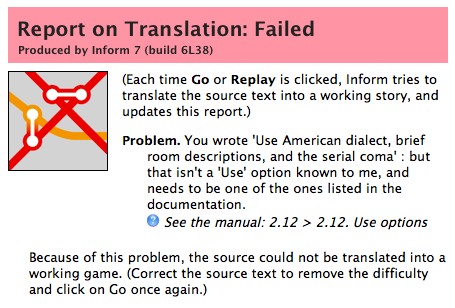

## The Inform 7 Program {#the-inform-7-program}

The first time you launch the Inform 7 program, a dialog box will ask you whether you want to open an existing project or start a new one. Since you don’t yet have a project to open, select “Start a new project...”. This will open a box in which you can name your project and tell Inform where you want to save it. (Use the Inform Projects folder in your Documents folder. If this folder doesn’t yet exist, it’s a good idea to create it.)


When you close this box, the Inform program will open, and you’ll see a main window with two pages — a left page and a right page. The left page will be blank except for the name of your new game and the byline (your name as the author). On the right page you’ll see the Table of Contents for the Inform Documentation.

What you’re looking at is not Inform itself (though you can think of it that way if you want to). What you’re looking at is a program that’s sort of a container for the Inform game programming system. This type of program is called an Integrated Development Environment, or “IDE” for short. The Inform IDE has quite a lot of useful features. Before you start writing your first story, take a quick look around the Inform IDE. Its most important features are discussed in the next few sections of this chapter; others are mentioned in Chapter 10.


Normally, you’ll want to keep the text of the story you’re writing (Inform calls this the “source text,” a term precisely equivalent to the more familiar term “source code,” which is used in most other programming languages) in the left-hand page. The right-hand page will contain various things at various times — the Documentation, the game itself, error messages, and so on. The IDE will sometimes open new _panels_ automatically within the right-hand page. But in fact you can display whatever you’d like in either page. If you’re studying two related pages in the Documentation, for instance, you could have one open in the left page of the IDE, and the other open in the right page at the same time. You can even run two instances of the Inform IDE at the same time, by opening additional project files. This way, you can keep the Documentation pages open at all times, or copy what you’ve written from one project to another.

To choose what’s displayed in each page, click on an item in the row of page headers. (This is displayed across the top of the pages in the Windows IDE, and vertically along the right edge in the Macintosh IDE.) Each header opens a different panel_._

Until you’ve written something in the Source panel and clicked the Go! button, some of the other panels will be empty. This is normal.

Feel free to click on the gray buttons beside the chapter headings in the Documentation. These triangles open the lists of pages for each chapter. Read a few pages. If you see things that you don’t understand (and you will!), please don’t worry about it. Even in Chapter 1 of the Documentation, some of the information is fairly advanced, and won’t be useful to you yet. Just take a look and get acquainted with how the Documentation is set up. To return to the Documentation’s Table of Contents, click the circle with the arrow, or the Home button above it.


You can click the right-pointing arrow to go to the next page within the Documentation, or the left arrow to go back one page. You’ll also find a pair of left/right browser-style buttons near the upper left corner of the pages, which will move you back and forth among the pages you have looked at most recently.

In _The Inform 7 Handbook,_ references to “the Documentation” are generally about _Writing with Inform._ The table of contents for _Writing with Inform_ is in the left column of the Documentation pane. In the right column is the table of contents of _The Inform Recipe Book._ The _Recipe Book_ is an entirely separate manual. Both of them are well worth reading. They share the same set of Examples. In fact, some of the pages in these manuals provide only a quick overview of a topic, an overview that is fleshed out with details in the accompanying Examples. Study the Examples carefully, and try to figure out what each section in each Example does. For tips on how to use the Examples, see “How to Use the Built-In Documentation” [here](./using_the_built-in_documentation.md#using-the-built-in-documentation).

### The Page Headers {#the-page-headers}


Across the top of each page, if you’re using the Windows IDE, or vertically along the edge if you’re using the Macintosh IDE, you’ll see a series of panel tabs, or headers: Source, Results, Index, Skein, Transcript, Story, Documentation, Extensions, and Settings. Below these main headers a variety of subheads (such as Examples and General Index) may appear. Clicking on any of the headers opens up a new panel. We’ll save a discussion of the finer points of how to use the Skein, Transcript, and Index for Chapter 10\. In this chapter we’ll just introduce the panels briefly.

The **Source** panel is where you’ll write your game. At the top of the panel you’ll see two buttons: Source and Contents. When you start designing your first game, the Contents panel won’t be useful; in fact, it will be empty except for a brief explanatory message about what it’s designed to do. In large or even medium-sized Inform projects, though, you’ll want to add heads and subheads to your source text. (To learn more about using headings, see [here](../chapter_9_phrasing_&_punctuation/headings.md#headings).) “Source” is computer jargon for what you’re writing — everything that you’re writing, in fact, both the text that will be displayed in your game when it’s played, and the instructions you give Inform that control how the game works.

>**Source: Code or Text?**
>
>Computer programmers call what they write _source code._ The term “code” goes back to the early days of computer programming, and probably reflects the fact that most computer programming languages look as abstract and hard to understand as messages encrypted in a secret code. The creators of Inform prefer to refer to what you write as _source text,_ because they feel “text” is a friendlier term to use to describe what you’ll be writing. However, most of the time, _The Inform 7 Handbook_ will refer to what you’re writing as “source code” or just “code,” because the word “text” in Inform also refers to the sentences you write between double-quotes, which are intended as output during your game. Ambiguity has its uses in literature, and also in real life, but in general it’s not desirable in computer programming situations. I prefer to use the word “text” specifically to refer to the output that your readers/players will encounter. Nonetheless, when discussing the source code that you write, we’ll sometimes use the word “text.”

Once you’ve added some headings, the Contents sub-panel within the Source panel will give you a quick way to navigate around in the source. You can quickly jump from one section to another section that’s hundreds of lines away, without having to use the scroll bar beside the panel and hunt for the section you’re seeking. At right is what a portion of the Contents of my game “A Flustered Duck” looked like back in 2009\. Clicking on any line of the tree will take you to that section of the source code. To see more or less detail in the Contents, you can use the menu (Mac) or slider (Windows) at the bottom of the Contents panel.


Inform is different from most computer programming languages in that the source for your entire project will be contained in one document (that is, in one file). Using the Contents panel, however, you can navigate through this document in much the same way that you would by jumping from one source code file to another if you were using a different programming language. (Technically, it’s possible to distribute your source code across a number of separate files and include these as extensions in your main story file; but this is not a recommended procedure.)

The Source panel provides an important and useful feature called **syntax coloring**. You don’t need to do anything to set this up: It happens automatically. As you start working with Inform, you’ll find that different types of text within the source will be displayed in different colors. For instance, text in double-quotes will always be blue. Syntax coloring is used in most forms of computer programming. It’s just a friendly feature to make it easier for you to read what you’re writing; the colors have no effect on the game itself.

The **Results** panel (which used to be called Errors) will open up automatically in the right-hand page when you click the Go! button (see below) if Inform can’t figure out what you wrote. Except when dealing with problems, you can ignore the Results panel.

The **Index** is extremely useful. Until you’ve compiled your first game, however (see “The Go! Button,” below), the Index will be blank. (Depending on the version of the IDE that you’re using, it may not open at all until you’ve successfully compiled a game.) In the process of turning your source text into a game, Inform creates and organizes lists of practically everything in the game. By consulting the pages of the Index, you can learn a lot about Inform, and also spot problems in your game, or just get an energy boost from seeing that your game is getting bigger as the automatically generated map grows.


The Index panel is divided into seven pages: Actions, Contents, Kinds, Phrasebook, Rules, Scenes, and World. We’ll have more to say about these in Chapter 10\. The Home button takes you to the overview display seen here. Clicking on any of the colored boxes will take you to a particular part of the Index of your game.

The **Skein** is used mainly for testing your game while you write it. The Skein will become a useful tool as your game gets more complex, but when you’re just starting out, you can safely ignore it. Briefly, the Skein keeps a record of all of your play sessions as you test your work-in-progress. One of the ways to test your work after making some changes is to open up the Skein, right-click (Mac: control-click) on one of the lozenge-shaped _nodes,_ and choose “Play to Here” from the pop-up menu. This will repeat the commands you typed on that particular run-through. For more on the Skein, you can consult **pp. 1.7, 1.8,** and **1.9** (“The Skein,” “A short Skein tutorial,” and “Summary of the Skein and Transcript”) in _Writing with Inform_. To learn a bit more about how to use the Skein, see [here](../chapter_10_advanced_topics/the_skein.md#the_skein) in Chapter 10.

The **Transcript** panel is also a tool for advanced programming situations. To be honest, in writing my first large Inform 7 game, I never used the Transcript, so I’m not sure how it might have made the writing process easier. It gives you a way to “bless” the output of a play-through of your game. If you later make changes in the game that change the output, the Transcript will highlight the changes in the output so that you can decide if you like them, or if you’ve made a mistake. If you’re playing through a long game quickly, this should save you the trouble of having to read every word in the output on every run-through.

The **Story** panel is where your game will appear, allowing you to try it out as you’re developing it. You can’t run other games in the Story panel (unless you download the source code), only the game that you’re writing. The appearance of your game in the Story panel will be similar to, but possibly not identical to, the way it will look in an interpreter. Other people will play your game in an interpreter (see “Downloading &amp; Playing Games,” later in this chapter), which is a separate program, or by running an online interpreter in a Web browser. As long as your game is written in English, the text of your game should be identical no matter what interpreter it’s played in. (Not all interpreters support the Unicode letters needed by other languages.) Even with games whose output is in English, the visual appearance and the type font may not be the same from one interpreter to another. For this reason, near the end of the process of creating an Inform story you’ll want to test your work in one or more other interpreters. Some interpreters may not have been updated for full compatibility with the latest version of Inform.

As a general rule, relying on the visual appearance of your game to give players important information is not a great idea. Not only will the appearance vary from one interpreter to another, but interactive fiction is popular among blind computer users, because they can easily play games of this type using screen reader software. In general, anything that your players will need to know to play the game should be presented as ordinary text. It’s possible to use Inform to create hybrid games that make considerable use of graphics, clickable links, and other resources, but the methods for doing this are beyond the scope of this _Handbook._ For more information, see **Chapter 23** of _Writing with Inform_, “Figures, Sounds and Files.”

The **Documentation** panel provides access to two large tutorial/reference works: _Writing with Inform_ and _The_ _Inform Recipe Book_. Both of these are hugely valuable resources, and you’ll want to get to know them. Also in the Documentation panel is a list of more than 400 Examples showing how to use Inform. For more on how to use the Documentation, turn to [this](./using_the_built-in_documentation.md#using-the-built-in-documentation).

The **Extensions** panel is where you’ll find the extensions that you’ve installed. Inform authors rely extensively on extensions, which are written by third parties. Extensions typically add new features to the Inform programming language. In this book we’ll be making use of a number of extensions. The details on how to add extensions to your Inform application can be found near the end of this chapter, starting [here](./extensions_for_inform.md#extensions_for_inform).

The **Settings** panel is not often needed. Its main purpose is to let you choose the type of output file you’ll use for your finished game. Older versions of Inform 7 defaulted to the .z5 format used in Infocom games, and gave you the larger .z8 format and the new Glulx format as options. Today, Glulx is the default. If your game contains images or sounds, you’ll need to switch to Glulx no matter how large or small the game may be, and also check the “Create a Blorb archive for release” box before clicking the Release button in the main toolbar. The .z8 format may be preferable for games intended to be played online in a web browser, but games that have more than a few rooms and objects are likely to exceed the memory capacity of .z8.

Inform’s ability to handle images and sounds is cool, but fairly limited. If you want to write a game that relies heavily on graphics rather than text, you may want to consider using some other development system, not Inform.

Also in the Settings panel is a checkbox to make random numbers repeatable while you’re testing your game. If your game relies on “rolling the dice,” for example to decide the outcome of a combat, to move some of the characters from room to room, or just to choose among a few random alternatives when printing out atmospheric bits of text, using this checkbox will let you test the game more easily.

### The Go! Button {#the-go-button}


In my kitchen I have a wonderful invention called a Zojirushi bread machine. It bakes home-made bread. All I have to do is measure the raw ingredients, pour them into the pan, close the lid, and press the Start button. Little paddles inside the machine knead the dough. Then the machine waits an hour for the dough to rise before it heats up and starts baking. Three hours after I put in the ingredients, I have a steaming hot loaf of fresh bread.

Inform’s Go! button is a lot like the Start button on my bread machine. The text you write in the Source panel is the raw ingredients — the flour, water, sugar, yeast, and so on. When you click the Go! button, Inform churns and kneads what you’ve written and turns it into a game that can be played. This function is explained on **p. 1.4** (“The Go! button”) of _Writing with Inform_.

This process looks very simple — you just click a button. But Inform does a huge amount of work to translate your source text into a game. This work is done by a software “machine” called a **compiler**. There’s no need for you to be concerned about how the compiler works its magic. But since we’ll be referring to it here and there in this book, you need to know that it exists, and what it does. The compiler turns your source text into a playable game.

If I put too much water into my bread machine, the machine won’t know. It will just produce a “loaf” that’s a soggy mess. If I forget to add the yeast, the machine will go ahead and do its thing, and I’ll end up with a hard, teeth-breaking lump. The bread machine doesn’t look at what I put in the pan — it just runs through its own process, step by step, automatically.



A compiler is a lot smarter than a bread machine. In order to do its work, the Inform compiler has to scrutinize every single line that you’ve written and figure out what to do with it. If it understands what you’ve written, a few seconds after you click Go!, your game will pop up in the right-hand page, ready to play. More than half the time, though, the compiler will encounter problems. It will hit a word, sentence, or paragraph that it can’t make sense of. Instead of your game appearing in the right-hand page, you’ll see a page like the one shown at right, in which Inform will report on the problems it ran into.

This is nothing to worry about — it’s normal. What you need to do is find the problems, fix them, and click Go! again. Depending on the exact problem(s), you may have to go through this cycle five or six times before your work-in-progress will compile successfully.

Next to each problem report in the right-hand pane, you may see a little orange arrow. When you click on this, the Source page will jump directly to the problem paragraph, which will be highlighted. If the problem is in an extension, a separate edit window will open containing the extension code. The orange arrow doesn’t always appear, however; in the report shown here, the problem is identified correctly (the word “comma” was misspelled as “coma” by the author), but no orange arrow is provided. The current release of the Macintosh IDE, in particular, seems not too fond of providing orange arrows. Nonetheless, the report will tell you what you need to fix; the IDE’s search function will enable you to find the incorrect line. You may also see a blue question-mark button. Clicking on this will take you to a page in _Writing with Inform_ that may (or may not) help you understand the nature of the problem.

Each problem message will give you some information about the type of problem the compiler ran into. Sometimes these explanations will make instant sense. Other times, they’re more confusing than helpful. For instance, if you write a text for output (in quotation marks) but forget to put the command “say” (not in quotation marks) before it, you’ll see an error message along these lines: “Problem. You wrote '"Some text."' : but this is a phrase which I don't recognise, possibly because it is one you meant to define but never got round to, or because the wording is wrong (see the Phrasebook section of the Index to check). Alternatively, it may be that the text immediately previous to this was a definition whose ending, normally a full stop, is missing?” As you can see, this message directs you to the line where the problem is, but misdiagnoses the problem. In general, Inform’s error messages have gotten progressively better, but they’re not likely ever to be perfect, simply because authors are so creative about inventing new errors.

After a while you’ll start to get a feel for the types of errors you usually make, and the problem messages you’ll see as a result. For more details, see “All About Bugs,” later in this chapter. But if all goes well, your game will appear in the right-hand page, in the Story panel, ready for you to try it out.

One thing you may want to know about the Go! button is that when you click it, the first thing that Inform does is save your Source to a file on disk. This new file will overwrite anything that was in the file before. So if you’re trying out various kinds of changes in your game, you may want to create alternate versions of the game — one to experiment with and one as a safe backup copy. To make a separate copy of the game that you can experiment with, use the Save As... command in the File menu.

>**Six Common Problems**
>
>As I watch beginners start to learn Inform, I see certain kinds of problems showing up over and over. Here, in no particular order, are some things to watch out for in your code:
>
>**Forgetting to say “say”**. You want the game to produce a certain text output in a certain situation, so you just write it, surrounding it with quotation marks as usual. In a couple of cases, such as descriptions of rooms, this is okay. But if you’re writing a rule in which you want Inform to say something, you have to say “say” before you start the quoted text.
>
>**Missing period at the end of a sentence**. Always end sentences with periods. There are some special rules about placing periods in relation to quotation marks, but if the sentence doesn’t have a period at all, Inform may get confused. If the sentence is in the middle of a paragraph of code (as opposed to a quoted block of output text), Inform is almost certain to get confused.
>
>**Misspelled word**. An easy problem to run into, and sometimes hard to spot. You’ll be typing the word “description” a lot, and at a high screen resolution you may not notice at first that you’ve spelled it “descripton” or “description”.
>
>**Colon instead of semicolon or vice-versa.** These two marks look almost alike on the screen, but they’re completely different. A semicolon is like a stop sign on the street; it tells Inform, “Okay, stop here for just a second, and then go on, because we’re not done yet.” A colon is like an arrow pointing forward — it tells Inform, “Do this next.”
>
>**Wrong indents.** See [here](../chapter_9_phrasing_&_punctuation/indenting.md/#indenting) in Chapter 9 of the _Handbook_ for a full explanation of how Inform handles indentation.
>
>**Jumbled thinking**. To write IF, you need to work in a patient, logical, step-by-step manner. Trying to design a complicated action sequence before you’ve learned the basics is guaranteed to frustrate you — and if you post plaintive questions on the forum asking for help, you may not understand or know how to apply the answers that more knowledgeable authors give you.

### The Release Button {#the-release-button}


When your game is finished — or maybe not quite finished, but far enough along that it’s ready to share with other people so they can test it, find problems, and offer suggestions — you can click the Release button. This will produce a game file in the .z8 or Glulx format, depending on what you’ve specified in the Settings panel. You can give this file to other people, or attach it to an email and send it to them. They’ll be able to load it into an interpreter and play your game.

Some of the features that you can use while testing your game in the IDE (see “Using the Debugging Commands,” later in this chapter) will not be available in the release version. However, the extremely handy Release For Testing command in the Release menu gives you a way to create a game file for your testers that _does_ include the debugging commands.

When you use the Release button, you’ll see (in the right-side panel) a list of suggestions for things you may want to consider adding to a released game. These options are not found in the Release menu in the IDE. Instead, you invoke them by adding statements to your source. For instance, you might want to write:

```inform7
Release along with cover art, a solution, and a website.
```

The release options are explained in **Chapter 25** of _Writing with Inform_, “Releasing.”

### Other Features {#other-features}

The Stop button is found only in the Windows IDE. It’s not used often, but you won’t be able to make certain kinds of edits in the Skein while the game is running. (That would be like trying to change to a new pair of ice-skates while skating around the rink.) The Stop button will end the current play session, making these Skein edits possible.

The Macintosh version of the Inform IDE includes, in the Window menu, a Customize Toolbar command. In the current version, however, this doesn’t work. In theory, you can drag a Watch or Breakpoints button into the toolbar, for instance — but Inform has, at present, neither of these types of functionality. (Watching expressions and setting breakpoints are techniques used by programmers in debugging computer software.) Perhaps in a future release of Inform, you’ll be able to add useful tools to the toolbar.
