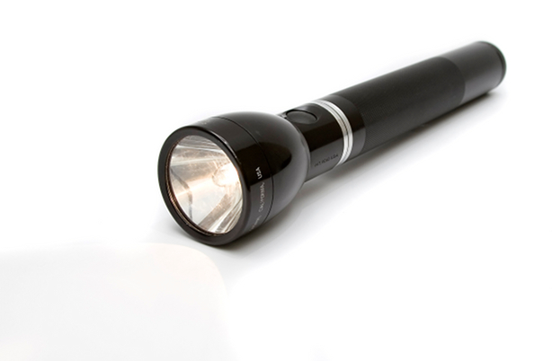

## Dark Rooms {#dark-rooms}

The very first interactive fiction, a game called Adventure, was set in a cave. Like most caves, it was dark. As long as the player was carrying a lantern, the game could be played in what we now consider the normal way. But any room where there wasn’t a light source would be pitch-dark.

In a dark room the player can’t examine anything, won’t be able to see things lying on the floor, won’t be able to LOOK to read the room description, most likely can’t read what’s written in books and on pieces of paper, and may not be able to find an exit reliably so as to go back to a lighted room. You should still be able to take an inventory of the objects you’re carrying while in a dark room, and (depending on how the game is written) you may be able to touch things in the room.



Today, the rooms in most games have light, so no lantern is needed. Rooms in Inform are always lighted unless you state otherwise.

**Page 3.15** in _Writing with Inform_, “Light and darkness,” explains how to create dark rooms, and how to create objects (such as torches and flashlights) that are lit. It’s a convention of IF that dark rooms are completely dark, but Example 345, “Zorn of Zorna,” shows how to create a system in which the amount of light in a room can be dim.

A dark room to which you have to bring a light source is a standard type of puzzle, and most players will have no trouble figuring out what they need to do. You might consider some variation that makes it harder to bring a light source. Two obvious ideas are a flashlight for which you have to find batteries and a candle whose flame blows out due to gusts of wind. Both of these have been used in a lot of games, though. To create a really good dark room puzzle, you’ll need to come up with something more imaginative — perhaps a glass jar full of fireflies, a secret lever that opens a louvered skylight, or a friendly ghost who glows in the dark and can be persuaded to follow you.

To create an object in Inform that provides light, all you need to do is say that it does:

```inform7
now the torch is lit;
```

In a real game, you might want the torch to burn out after a fixed number of moves, making a timed puzzle. Or finding the matches with which to light the torch might be a separate puzzle. If the object is lit from the start of the game, you’d do it this way:

```inform7
The ghost is a person. The ghost is lit.
```

But what if the player is in a dark room, and you want her to be able to find the switch so as to turn on the light? This situation can trip up the novice author, and here’s why: Inform assumes that when things are in a dark room, the player can’t sense or manipulate them. If the light switch is in the dark, the player will never be able to use it.

Here’s a simple example that shows how to get around this problem. It involves using a special rule to add the light switch to scope. Also included are customized rules about how to announce darkness and — much more important for this example — how to print the description of a dark room. These methods are described in Chapter 17 of _Writing with Inform_, on **pages 18.19** (“Printing the announcement of darkness”) and **18.22** (“Printing the description of a dark room”). We need a special way to print the description of the room we’re calling the Library when it’s dark, because otherwise the player will have no idea that there’s a light switch in the room. “Guess what you can do in a dark room” is a very unfair type of puzzle.

```inform7
The Library is a room. "Thousands of books line the shelves. An old-fashioned lamp with a green lampshade sits on the table. Mounted on the wall beside the door is a light switch." The Library is dark.

The oak table is a supporter in the Library. The old lamp is on the table.

The light-switch is a device in the Library. The light-switch is scenery. Understand "light" and "switch" as the light-switch.

Instead of switching on the light-switch:
        now the lamp is lit;
        say "By groping on the wall near the door, you find a light switch. Click -- the lamp goes on."

Instead of switching off the light-switch:
        now the lamp is not lit.

Rule for printing the announcement of darkness:
        if the location is the Library:
                say "Click -- the room is plunged into inky darkness." instead;
        otherwise:
                say "It is now pitch dark in here!"

Instead of switching off the old lamp:
        try switching off the light-switch.

After deciding the scope of the player when the location is the Library:
        place the light-switch in scope.

Library darkness count is a number that varies. Library darkness count is 0.

Rule for printing the description of a dark room:
        if the location is the Library and the library darkness count is greater than 0:
                say "You can't see a thing -- but as you grope around in the darkness, your fingers touch a switch on the wall.";
        otherwise:
                increase the library darkness count by 1;
                say "It is pitch dark, and you can't see a thing."

Test me with "look / switch switch".
```

If you look closely at the code above, you’ll see a couple of other refinements as well. The game starts in the Library (since there’s only one room), and we don’t want the message about groping around and finding the light switch to appear at the very beginning of the game. So we create a counter (a variable) called “library darkness count.” At the beginning of the game, this is 0 — but the first time the description of a dark room is printed, the counter is increased to 1\. Thereafter, when the player uses the LOOK command in the Library, she’ll discover the light switch.

I also used an Instead rule so that if the player tries SWITCH OFF LAMP, the command will be redirected to SWITCH OFF LIGHT-SWITCH. This keeps all of the handling of the lamp’s on/off condition in one place — in the switch. The switch is an Inform **device** ([here](../chapter_3_things/mechanical_marvels.md#mechanical-marvels)), which as explained in Chapter 3 is one of the kinds of object that Inform allows you to create.

### Backdrops in Dark Rooms {#backdrops-in-dark-rooms}

Inform assumes, by default, that a backdrop is something that a player will want to look at. For that reason, backdrops are not present in dark rooms, even when you’ve written code that states the backdrop is everywhere. If your game includes a backdrop that the player may want to smell, you’ll need to do a little extra work. Here’s how to create a backdrop that can be smelled even in a dark room:

```inform7
The Forest is a room. "All around you stretches the Great Northern Forest. To the east is a cave."

The Cave is east of the Forest. The Cave is a dark room.

The air is a backdrop. It is everywhere. The description of the air is "You can't see the air!"

Instead of smelling the air:
        if the player is in the Cave:
                say "Dank and foul.";
        otherwise:
                say "Fresh."

After deciding the scope of the player when in darkness:
        place the air in scope.
```

The “After deciding the scope of the player” rule insures that the air will be present in the Cave.
