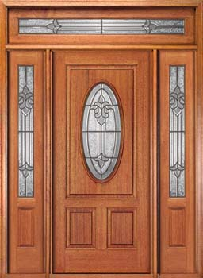

## Enterable Scenery {#enterable-scenery}

When the “room” is an outdoor location and a building is nearby, making the exterior of the building scenery is a good idea. This is not hard to do, but it can lead to two small problems that we need to look at.

First, we can’t give the building’s scenery exterior the same name as the room that is its interior. This might easily happen with a one-room building such as a barn or hut. This won’t work:

```inform7
The Farmyard is a room. "A muddy farmyard. A little red barn stands to the north."

The little red barn is scenery in the Farmyard. The description is "The barn is freshly painted a cheerful bright red."

Little Red Barn is north of the Farmyard. "In the barn you can see some stalls and some hay." [Error!]
```

The compiler will object, quite rightly, that we’ve tried to name two things — a scenery object and then a room — using the same name. Here’s how to solve the problem:

```inform7
The barn-exterior is scenery in the Farmyard. The description is "The barn is freshly painted a cheerful bright red." Understand "little", "red", and "barn" as the barn-exterior. The printed name of the barn-exterior is "little red barn".
```

Now the scenery object has its own name for code purposes, barn-exterior. But we’ve given it “little”, “red”, and “barn” as vocabulary, and we’ve also told Inform that if the game ever needs to print out its name for reader/players, it should call it “little red barn.”

The second problem we need to deal with is that the player may try ENTER BARN as a command. Unless we say otherwise, Inform will report to the player that scenery objects can’t be entered. When the scenery object is a building exterior, this is both rude and misleading. But it’s easy to fix. While we’re at it, we’ll allow the player to use IN as a command, when in the Farmyard, in order to enter the little red barn:

```inform7
Instead of entering the barn-exterior:
        try going north.
Instead of going inside in the Farmyard:
        try going north.
```



If the enterable thing is small (a refrigerator carton or phone booth, for instance) we might want to make it an enterable container rather than a separate room. (See the section on “Enterable Containers &amp; Supporters” in Chapter 3.) With a larger object, making it a separate room will work better.
