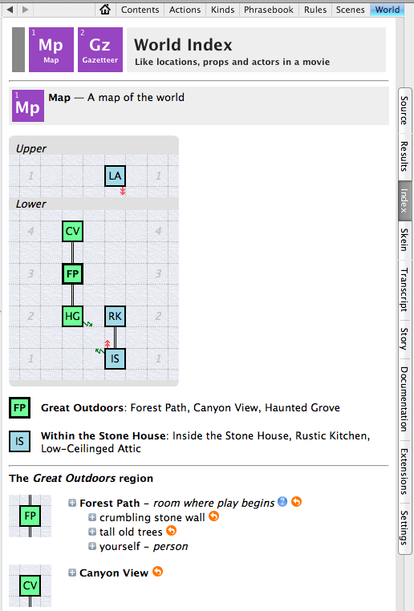

## Regions {#regions}

As explained on p. 3.4 of _Writing with Inform_ (“Regions and the index map”), using regions is a nice way to keep a larger map organized. After you’ve defined some regions, you’ll also be able to use some of Inform’s world-building features more easily. This is because you can test what region the player is in, and do something with the information. For instance, after creating a region called Forest, you could do this:

```inform7
Every turn when in the Forest:
        say "[one of]A bird chirps.[or]You hear a soft rustling in the bushes.[or]A butterfly flits past you.[at random]".
```



(The elements inserted in square brackets in a double-quoted text give Inform instructions about how to print out the text. In the example above, the bracketed insertions allow Inform to produce a text output that changes. For more on this topic, see “Text Insertions” in Chapter 8 of the _Handbook_.) Creating a region and adding rooms to it is simple. You do it like this:

```inform7
Forest is a region. Forest Path, Haunted Grove, and Canyon View are in Forest.
```

Once you’ve created a region, the Inform IDE will color the rooms of the region to match one another in the Index Map. This is one of several features in the IDE that will become more useful as your story gets larger. At right is a simple map based on some rooms we’ve used earlier in this chapter. There are two regions, one (the Great Outdoors) colored green and the other (Within the Stone House) colored blue. The room where the player character is located at the start of the story is Forest Path; it’s surrounded by a darker outline. The room called Low-Ceilinged Attic is shown in the upper level because it’s mapped upward from Inside the Stone House (abbreviated IS on the map).

I’ve found that it’s safer to define a region _after_ creating the rooms that will be in it — that is, the region definition should be placed below the rooms in the source code. This is because the room object is created the first time it’s mentioned in the code. Inform understands that the only things that can be in regions are rooms, so it will add a new room when you first create the region, if it doesn’t already know about that room. Some of the ways that you can write sentences that create rooms will confuse Inform if it already knows about a room that has that same name. Also, you need to be sure to use exactly the same room name in the region list that you use when creating the room. If there’s a typo in the room name in the region list, Inform will cheerfully create a second, featureless room whose name has a typo in it. This can lead to hard-to-find bugs.

For consistency, and to make your code easier to read, I suggest always using the word “Area” in the names of your regions. So I would edit the code above to read like this:

```inform7
Forest Area is a region. Forest Path, Haunted Grove, and Canyon View are in Forest Area.
```

You can create one region that’s entirely within another region, but Inform won’t let two regions overlap one another. When creating a region that’s contained in a larger region, it’s important to mention the rooms in only one region definition. The following won’t work:

```inform7
Room1 is a room. Room2 is a room. Room3 is a room. Room4 is a room. Room5 is a room.

The Big Area is a region. Room1, Room2, Room3, Room4, and Room5 are in the Big Area.

The Little Area is a region. Room1, Room2, and Room3 are in the Little Area. [Error!]
```

Here’s how to get the desired result:

```inform7
Room1 is a room. Room2 is a room. Room3 is a room. Room4 is a room. Room5 is a room.

The Little Area is a region. Room1, Room2, and Room3 are in the Little Area.

The Big Area is a region. The Little Area, Room4, and Room5 are in the Big Area.
```

Notice that the Little Area is defined before the Big Area. This is so we can refer to the Little Area in the region definition for the Big Area. If we try to do it in the other order, Inform will think “Little Area” is a room — because anything in a region has to be a room. It will then get confused when we tell it that Little Area is a region. If you do it as shown directly above, it will work.

If you need to create regions (that is, groups of rooms) that overlap or that change during the course of the game, the workaround is fairly simple: Don’t use defined regions at all. Instead, use properties. For example:

```inform7
A room can be cursed or uncursed. A room is usually uncursed.

Every turn when the player is in a cursed room:
        say "Oooh, scary!"
```

At any point in the game, you can change a room from cursed to uncursed or vice-versa with a single line of code:

```inform7
now the Dormitory is uncursed.
```
