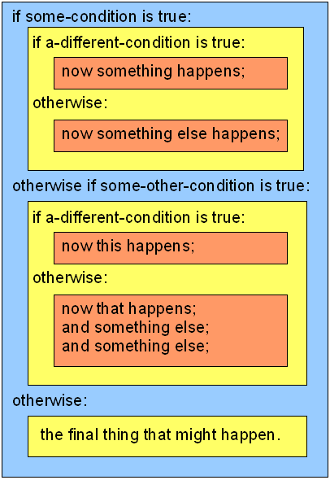

## Indenting {#indenting}

Computer programmers (including Inform authors) often need to write blocks of code that will be run, line by line, in a certain order. Such blocks often need to branch based on whether a logical test is true or false. The keyword “if” is used in many programming languages, including Inform, to write a statement that will allow the code to branch. In pseudo-code, a short version look be something like this:

        if A, do X; otherwise, do Y.

Here, “X” and “Y” would be entire lines or multiple lines of code. A more complex (and more realistic) example might look more like this:

        if A, do Q, R, and S; otherwise, do X, Y, and Z.

Again, “Q,” “R,” “S,” and so on would be entire lines of code. In this situation, the compiler needs some way to understand which lines of code to group together into a block. Q, R, and S should be grouped together, and X, Y, and Z should be grouped together — but it would be horribly wrong to have all six grouped together!

Two systems for organizing lines of code into blocks (groups of lines) are in common use. Some languages use indenting. Other languages don’t require indenting (though indenting can be used to make their source code easier to read). Languages that don’t use indenting usually put brackets or curly braces (like these {...} ) around blocks of code.

The original release of Inform 7 used neither system. Instead, in keeping with the “natural language” idea, the keywords “begin” and “end” were used to set off code blocks. Here is an example (borrowed from Chapter 4 of this _Handbook_) using the syntax format that Inform originally provided:

```inform7
Before taking the apple:
if the player does not carry the apple begin;
if the player carries the basket begin;
if the apple is not in the basket begin;
now the apple is in the basket;
say "You pick up the apple and put it in the basket.";
rule succeeds;
end if;
end if;
end if.
```

This type of syntax can still be used in Inform, as noted briefly on **p. 11.7** of _Writing with Inform_, “Begin and end.” And in fact, when you get error messages from the compiler you may still find a reference to “begin;”, even though you didn’t use “begin;”.

As you can see, the internal logic of a block of code that ends with a string of “end if” lines can be hard for a human reader to follow. You can use indentation to make the code easier to read without changing the syntax in any way. Here is the same code with added white space (a big improvement).

```inform7
Before taking the apple:
        if the player does not carry the apple
        begin;
                if the player carries the basket
                begin;
                        if the apple is not in the basket
                        begin;
                        now the apple is in the basket;
                        say "You pick up the apple and put it in the basket.";
                        rule succeeds;
                        end if;
                end if;
        end if.
```

That white space might be either Tab keys or rows of spaces — it doesn’t matter, because the indenting is just to make the code easier for you to read. The compiler ignores it.

On the other hand, if we’re going to use indentation to make the code easier to read, why not dispense with the “begin/end” keywords entirely? After Inform 7’s initial release, there was apparently a groundswell of support for the idea of letting Inform authors use indentation _instead_ of “begin;” and “end if;”. This style of code formatting is sometimes referred to as Pythonesque, because it’s used in the popular Python programming language. Below is exactly the same code as in the example above, rewritten to use colons in place of “begin;”, and indenting to keep track of where each if block ends. Many Inform programmers today seem to prefer this method:

```inform7
Before taking the apple:
        if the player does not carry the apple:
                if the player carries the basket:
                        if the apple is not in the basket:
                                now the apple is in the basket;
                                say "You pick up the apple and put it in the basket.";
                                rule succeeds.
```

The “end if” statements are no longer needed, but the indentation must be used as shown, and it must use Tab characters, not series of spaces. I find this much easier to read.

I’ve found that newcomers to Inform authoring quite often don’t pay enough attention to how many indents (that is, how many Tab key presses) they need for a particular line of code. If the indenting is wrong, the compiler will get confused. To make matters worse, some email programs turn indents into strings of space characters. They look the same on the screen, but Inform requires Tabs, not spaces. So emailed code can get messed up, even if you’ve used standard copy-and-paste to paste the code into the email.

The source code editor in the Inform IDE (the authoring program) formats each long paragraph with “hanging indents.” That is, each line of a paragraph after the first one is indented slightly. This is purely to make the code easier to read. The hanging indents have nothing to do with indenting code blocks to create organization, as shown above. They’re purely a way of making the code a bit easier to read on the screen. (Multi-line paragraphs in this Handbook don’t have hanging indents, so they won’t look exactly the way they will look in the IDE.)

When do you indent? The rule is simple: **After a colon, you indent by one more Tab than the line that ends with the colon.**

Basically, a colon means “do the following action(s).” Following every colon is a list of one or more steps that you want Inform to take. We can call this list of steps a _block_ of source code. The block of code should be indented by one more level (that is, one more Tab key) than the statement before it — the if-statement that had a colon at the end. Everything that is indented further than the line that ends with the colon is part of that block of code, so it will run if the if-statement (or some other colon-ended line, such as “Every turn:”) tells it to. When we return to the same level of indentation as the line that ended with the colon, we’re done with that inner block of code and ready to proceed with the next statement in the outer block.

Yes, that description is hard to read. The diagram on the next page may help make the organization of code into outer and inner blocks easier to visualize. Each line in each of the colored blocks in that diagram is indented one Tab further than the lines in the block outside of it.



Here’s an example from a recent game of my own that may make this idea a little more real-world. If you don’t understand what’s going on here, you might want to look back at the section “Testing Conditions.” In that section, if statements are explained.

```inform7
Some eyes are part of Elliott. The description is "You can't see your eyes! They're just there."

Instead of closing the eyes:
        if Elliott wears the black blindfold:
                say "Closing your eyes will make no difference. You're wearing a blindfold.";
        otherwise if the location is a crystal room:
                say "You close your eyes for a moment against the dazzle of sunlight on crystal, but a moment later you bump into something and your eyes fly open again.";
        otherwise:
                say "You close your eyes for a moment. Ah, how restful!"
```

This Instead rule will run when the player types CLOSE EYES. The outer block of code in the rule begins with the colon at the end of the first line. There are three lines in the outer block of code. The first line begins “if Elliott wears...”, the second begins “otherwise if the location...”, and the third is “otherwise:”. These lines are indented with one Tab. After “if Elliott wears the black blindfold:”, we need to indent by two Tabs to create an inner block of code. This happens to have only one line in it, a say statement — but it could have many more lines.

Note that the statement that begins “say “You close your eyes for a moment...” is only a single line as far as Inform is concerned. It happens to flow down onto the next line, but the fact that the next line isn’t indented doesn’t matter, because there’s no _carriage return_ character before it. In the IDE, long lines like this have what’s called a “hanging indent,” which makes it easy to see that they’re all part of a single code statement.

Nothing in the Instead rule shown above actually changes the model world; all it does is print out one of three different messages, all of which are more or less equivalent to saying, “You can try that, but it won’t do any good.” But if the rule also included a line like “now the blindfold is transparent;” the organization of the code into outer and inner blocks would be the same.

### Too Many Indents {#too-many-indents}

If you’re writing an extremely complex, embedded set of if-tests, it’s easy to lose track of where you are in the logical structure. In this case, you’ll probably want to reorganize your code in some other way, so as to make it easier to read and debug.

There are several ways to reduce the number of indentation levels. For instance, these two Instead rules are functionally identical, but one uses two indent levels, while the other uses only one:

```inform7
Instead of eating the pretzel:
        if the pretzel is salty:
                say "Recognizing that the salt is the best part, you pause and lick off the salt first.";
                now the pretzel is not salty;
        otherwise:
                continue the action.

Instead of eating a salty pretzel:
        say "Recognizing that the salt is the best part, you pause and lick off the salt first.";
        now the pretzel is not salty.
```

If you need to perform a number of operations (such as changing various values) within a block of code, you can reduce the indentation by using a To statement. Here’s a quick example that expands slightly on a few lines that appeared earlier in the Handbook_:_

```inform7
After attacking the ceramic bowl:
        if the guard is in the location:
                if the guard is awake:
                        sound the alarm;
                otherwise:
                        [more code goes here...]

To sound the alarm:
        if the ceramic bowl is shattered:
                [more code goes here...]
```

The line “if the ceramic bowl is shattered” has only one indent, because it’s in a separate block of code. If it were embedded after “if the guard is awake” in the “After attacking the guard” rule, it would have three indents.
