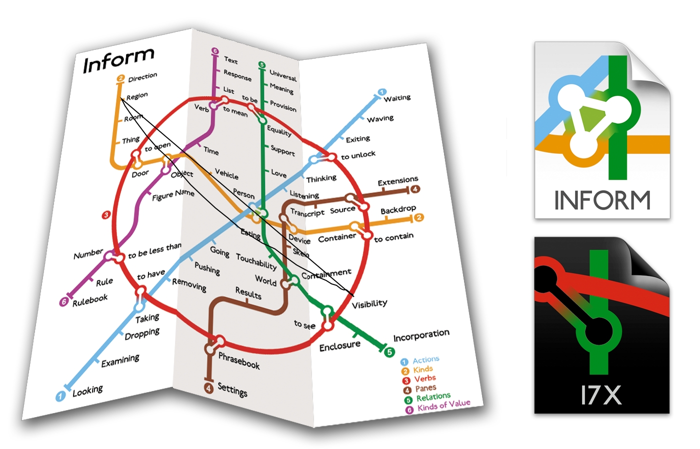

# I7Handbook {#i7handbook}

Inform 7 Handbook

by Jim Aikin

version 2.0 (May 2015)

valid for 6L38

# Use & license

_The Inform 7 Handbook_ is copyright (c) 2015 by Jim Aikin. _The Inform 7 Handbook_ has been released under and is subject to the terms of the Creative Commons Public License, the terms of which are hereby incorporated by reference. Please see Appendix C of this book and read it before using this material. Your use of this material signifies your agreement to the terms of the License.

You are free to copy, distribute, and transmit this work, and you are free to excerpt and adapt it, in whole or in part, subject to the following conditions:

1) You must attribute the work by prominently displaying the words “_Inform 7 Handbook_, by Jim Aikin.”

2) You may not in any way suggest that Jim Aikin endorses you or your use of the _Inform 7 Handbook_.

3) You may not receive any monetary or other compensation for your copying, distribution, or transmission of this work, nor for any derivative work that incorporates it, in whole or in part.

4) If you alter, transform, or build upon this work, you may distribute the resulting work only under the same or similar license to this one.

5) For any reuse or distribution, you must make clear to others the license terms of this work by incorporating the text of the license (see Appendix C), or by including a link to a Web page wherein the license resides.
