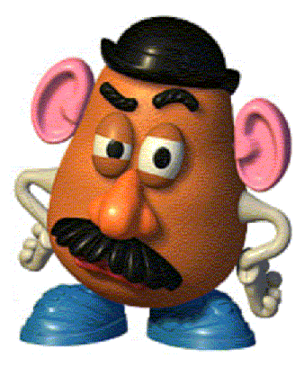

## Mr Potato Head



The next example game illustrates several useful points. First, it shows how to make parts that can be attached to or detached from an object. (In this case, the object is the ever-obliging Mr Potato Head.)

```ìnform7
The Potato Factory is a room.

Mr Potato Head is a man in the Factory. The description is "Mr Potato head is big and round and brown[attachment-list]."

To say attachment-list:
        let count be 0;
        repeat with item running through things that are a part of Mr Potato Head:
        increase count by 1;
        if count is 0:
                do nothing;
        otherwise:
                if the lips are part of Mr Potato Head:
                        increase count by 1;
                say ". Adding an attractive facial character to Mr Potato Head [if count is greater than 1]are[otherwise]is[end if] [a list of things that are part of Mr Potato Head]".
```

The point of the “say attachment-list” code is that we want to append a list of Mr Potato Head’s features to his description. Just to make things slightly more interesting, the lips are plural-named, so if the lips are part of Mr Potato Head we need to increase the count by 1 in order to print out “are” rather than “is” if the lips are the only feature that has been attached.

Next, we’ll create some facial attachments, and also an irrelevant item (the banana) for testing purposes.

```ìnform7
A facial attachment is a kind of thing. The nose is a facial attachment. The left eye is a facial attachment. The right eye is a facial attachment. Some lips are a facial attachment.

The player carries the nose. The player carries the left eye. The player carries the right eye. The player carries the lips.

The player carries a banana.
```

The command the player is most likely to try is of the form PUT NOSE ON MR POTATO HEAD. But as far as Inform is concerned, putting it on is a different action from tying it to, so we need to redirect the putting it on action using an Instead rule. The next Instead rule handles both the error-checking for the adding of facial attachments, and the action.

```ìnform7
Instead of putting something on Mr Potato Head:
	     try tying the noun to Mr Potato Head.

Instead of tying something to Mr Potato Head:
      	if the noun is not a facial attachment:
            		say "That's not something you can attach to Mr Potato Head.";
      	otherwise if the noun is part of Mr Potato Head:
            		say "[The noun] [are] already attached to Mr Potato Head.";
      	otherwise:
            		now the noun is part of Mr Potato Head;
            		say "You attach [the noun] to Mr Potato Head."
```

In creating our new detaching it from action, we also need to consider that the player’s most likely command is simply TAKE NOSE. The parser’s default response would be, “That seems to be a part of Mr Potato Head.” Inform very sensibly doesn’t let the player go around removing the parts of things. So we need another Instead rule to map TAKE NOSE onto the detaching it from action.

```inform7
Detaching it from is an action applying to two things and requiring light. Understand "detach [something] from [something]" and "remove [something] from [something]" as detaching it from.

Check detaching it from:
        if the noun is not part of the second noun:
                say "But [the noun] [are] not attached to [the second noun]." instead;
        otherwise if the noun is not a facial attachment:
                say "[The noun] [do] not appear to be detachable." instead.

Carry out detaching it from:
        now the player carries the noun.

Report detaching it from:
        say "You detach [the noun] from [the second noun]."

Instead of taking something:
        if the noun is part of a thing (called the owner):
                try detaching the noun from the owner instead;
        otherwise:
                continue the action.
```

And finally, just for fun, we’ll add a victorious outcome to the game:

```inform7
Every turn:
        if the left eye is part of Mr Potato Head and the right eye is part of Mr Potato Head and the lips is part of Mr Potato Head and the nose is part of Mr Potato Head:
                say "'Oh, thank you!' cries Mr Potato Head. 'You've restored my faith in human nature!'";
                end the story saying “You have won!”
```
