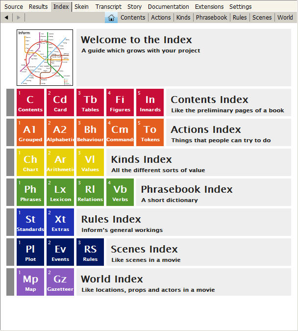

## Using the Index

I really shouldn’t have buried a discussion of the Index panel in the Inform IDE way back here in Chapter 10, but I didn’t know where else to put it. Until you’ve learned a bit about Inform programming, what you see in the Index may not make a lot of sense. Once you’ve started working with Inform, however, you’ll find it extremely useful.

The Index only appears after you have successfully compiled your game at least once in your current work session. Until the project has been compiled, the Index panel will be empty.

Across the top of the Index panel are eight buttons. The Home button (highlighted in blue in the image at left) displays a navigation page to the Index as a whole. By clicking the other tabs along the top, you can view Contents, Actions, Kinds, the Phrasebook, Rules, Scenes, or the World of your story. Alternatively, clicking on any of the square buttons will take you directly to one of the subsections of the index.

The main point of the Index, as you might expect, is to make it easy to find things in your project. Many of the items listed in the Index have clickable buttons beside them. Clicking an orange button with a curving arrow will take you to the place in the Source where that item is first mentioned. Clicking on a gray magnifying glass button will open up a page of details deep within the Index, where you’ll see more detail. Clicking a blue question-mark button will take you to a page in _Writing with Inform_ where the item is discussed.

On the main pages within the index, each square (such as “A1 Grouped” in the Actions index or “Lx Lexicon” in the Phrasebook index) has at least one blue question-mark button next to it. If you’re not sure what type of item is being displayed in a given portion of the Index, click on this button to go to the page where it’s discussed. Then use the Back arrow in the upper left corner to return to the Index page.

Blue-gray squares in the Index can be clicked to copy a bit of code into your source code at the spot where your text entry cursor is located. Under Innards in the Contents page, for instance, you’ll find squares that can insert Use options. (These should normally be placed just after your story title, at the very start of the source code.)

If you scroll down a bit in the Phrases display in the Phrasebook page, you’ll find a long list headlined “Saying.” Beneath this are individual things that can be put into say phrases, with gray + buttons. Clicking these buttons will give you a more detailed description of such things as “say ‘[time in words]’”. Similar gray buttons are found in the Standards display of the Rules index. If you spend a little time reading the information on these pages, you’ll learn a lot about what you can do with Inform.

Much of the Index is devoted to Inform’s Standard Rules. But as you develop your story, your own code will be fully incorporated into the Index. After writing some Instead rules and successfully compiling the game, you’ll find these rules listed in the Instead rulebook under Rules/Standards. Any extensions you have included in your game will also be indexed.

Under the World tab, you’ll find a graphic map showing all of your rooms and the connections among them. Inform’s attempt to map complicated layouts is not perfect (nor could it be). On **p. 25.18** of _Writing with Inform_ you’ll find some suggestions on how to improve the map. After a bit of tweaking if necessary, this map can be exported as an EPS file, as explained on **p. 25.19.** You may find this convenient, but my own preference is to create a PDF map by hand using a freeware drawing program such as OpenOffice.
