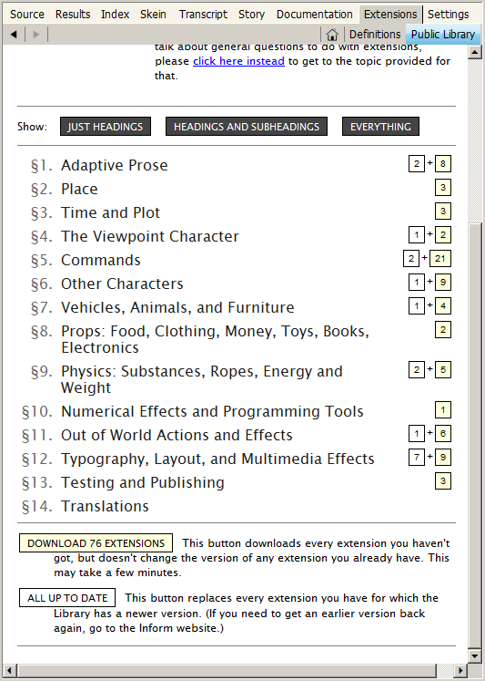

## Extensions for Inform

A number of people in the Inform 7 community (which exists almost entirely on the Internet, though local meet-ups have popped up here and there) have written _extensions_ for Inform. An extension is a file containing code that can be used by authors to do something specific — something that’s not included in the standard version of Inform.

There are extensions for creating tricky kinds of objects, such as liquids and secret doors; for producing smoother and more interesting conversations between the player character (PC) and non-player characters (NPCs); for constructing menus of hints that your players can consult; and for many other purposes.



Extensions are written using the Inform programming language — so technically, an extension can’t do anything you couldn’t do yourself. But most of them were written by experts, they have been tested and debugged, and they come with documentation that tells how to use them. So why spend a week working out how to do something tricky when you can download an extension and have it working in half an hour?

Unfortunately, as of 2015 the situation with respect to extensions has become a bit disorganized and confusing. It was formerly the case that all extensions could be downloaded from the Extensions page of the Inform 7 website (http://inform7.com/write/extensions/). But most of the material on this page is now obsolete. It’s useful to have access to the older extensions if you’re running an older version of Inform for some reason, so there’s a reason to keep this material available. But in versions 6L02 and 6L38, some basic things in the Inform programming language have changed. As a result, many of the older extensions won’t run in the new versions of Inform. If you try to include one, the compiler will issue an error message. Bottom line: Unless you know what you’re doing, do not attempt to download extensions one at a time manually from the Inform website.

Some authors have updated their extensions to work with the new version, but others haven’t. If you want the features in an extension that hasn’t been updated, you may possibly be able to fix the problems yourself; Appendix B of the _Handbook_ provides a few details on how to attempt this.

If you’re new to Inform authoring, you can avoid much of the confusion. After downloading and installing the Inform program, switch to the Extensions page in the program, click the Public Library header, and scroll to the bottom of the page, as shown at right. You’ll see a yellow DOWNLOAD EXTENSIONS button; the number may be larger than 76, as more extensions are added to the library. Click this button. Inform will download the extensions and install them for you, and you’ll be ready to go.

Once the extensions have downloaded, the documentation for each extension will now be available under the Home button in the Extensions page of the Inform program. You’ll find that the extensions are listed alphabetically by the first name of the author.

If you’re upgrading to Inform 6L38 (or a later version) from an earlier version and you already have some extensions installed, you’ll need to use a slightly more complex process. Basically, you need to drag your old folder of extensions off somewhere, so that Inform won’t be able to find it. In Windows, the usual location for this folder is My Documents/Inform. In the MacOS, it will be in the Library folder in your folder in Users (for instance, Users/jimaikin/Library/Inform). However, the MacOS tends to want to hide this Library folder from users. If you can’t find it, open a Terminal window. Type this line (carefully) and hit Return:

``chflags nohidden ~/Library/``

This code will make the Library folder show up. Please don’t make any other changes in the Library! Once you’ve deleted the Extensions folder from Library/Inform, you can use the Download Extensions button as described earlier.

Once your new extensions are installed, using one of them in your game is easy. Near the top of your source code, just below the name of the game and the author byline, enter a line like this:

```inform7
Include Notepad by Jim Aikin.
```

This format is required: You have to give the name of the author, and you can’t put a comma after the name of the extension.

It’s possible to open extension in a new window in the Inform IDE and edit the code just the way you would any other Inform code. Irecommend that you not do this. Until you become an Inform power user, it’s far too easy to create messy problems by editing an extension. If you want to try editing an extension — for instance, because you think it has a bug in it — make a backup copy of it first by copying the file and pasting it to a new folder on your hard drive. That way, if you don’t get the results you’re expecting, you can restore the original version without needing to download it again.

Some extensions use other extensions. If extension A uses extension B (by including it, as shown above) but extension B has been updated more recently than extension A, extension A may now be broken. In this type of situation, your best bet is to report the problem, either in the intfiction.org forum or directly to the extension author.
