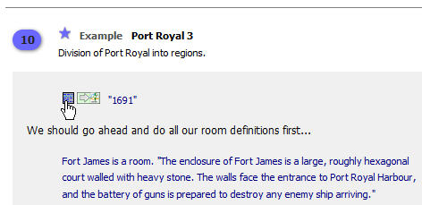
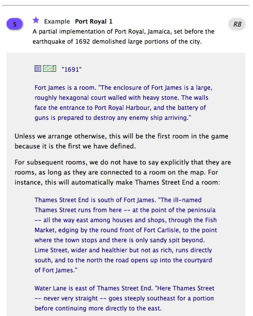

## Using the Built-In Documentation

Many people use Inform’s built-in Documentation as a combined tutorial and reference guide. When starting out, you’ll probably want to use it more as a tutorial. To do this, read Chapters 2 through 7 and try out the Examples. The examples can easily be copied into a test game so you can try them out and experiment with them.

First, start a new project or open up a project that you don’t mind trashing. I keep a game called Test Game on my hard drive for this purpose. (Actually, I have dozens of them.) You pretty much have to start with a blank Source when trying the Examples, because pasting the Example code into an existing game will most likely make a mess of a game that you’re already working on.

After navigating to the Documentation page that you’re interested in and possibly scrolling down to the bottom, open up an Example by clicking on the blue lozenge-shaped button with the number. If the Source page in your Test Game is still empty, you can click on the square blue button by the first line of the code in the Example. This button will copy the entire Example over to the Source page. If you’re already working on a game and don’t have an empty Source page, click on the arrow button instead. This will open an entirely new Inform IDE window with the Example code loaded. Now all you need to do is click Go!, and the Example will turn into a short but playable game. After playing the game to see what it does, try changing some of the source code and play it again. This is a great way to learn how Inform works. (Due to ongoing changes in the Inform language, however, it’s possible that a few of the older Examples won’t work correctly. If you encounter this type of problem, post a message asking for help on the Interactive Fiction Forum, http://www.intfiction.org.)

All of the Examples are used in both _Writing with Inform_ and the _Recipe Book._ If you’ve opened the Example from within _Writing with Inform,_ the yellow RB button on the right side of the Example’s header takes you to the page in the _Recipe Book_ where it’s used. From Examples in the _Recipe Book,_ the gray WI button will take you back to the Example in _Writing with Inform._

Once you’ve read through large parts of the Documentation (perhaps several times), it will get easier to find the information you need. The Documentation now has an index, which you can reach by clicking the General Index tab at the upper right corner. In case that doesn’t get you where you need to go, the IDE includes a Search field. You can type whatever you’d like in this field, and Inform will go through all of the Documentation looking for matches. You may find anything from no matches to dozens of them. The more specific you can be about what you’re looking for, the better the Search engine will work. Phrases like “end the story” and “omit contents in listing” will work better than something like “scenery”, which produces way too many matches. In the Windows IDE, the search results will be highlighted in the text, making the word or phrase easy to find. The Macintosh IDE does not yet have this neat feature.

Once you’ve successfully compiled your story for the first time, the Index panel will contain numerous links (the blue question-mark buttons and gray magnifying-glass buttons) to the Documentation. Before too long you should take some time to explore the Index. While it’s almost bewilderingly thorough, has links to lots of good information.
