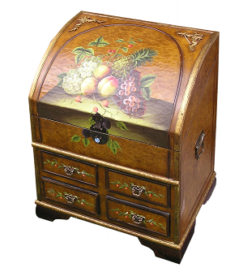
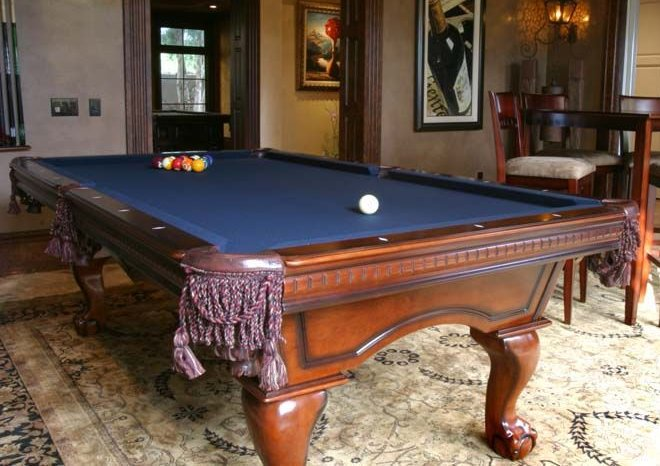

## Containers &amp; Supporters {#containers-supporters}

Every object in your model world (except backdrops and doors, which operate in a slightly different way) is either in a room, or it’s off-stage. If an object is off-stage, it’s nowhere, at least at the moment. But even when something is off-stage, it’s still part of the game, and could be moved into play later on. (See the section “Moving Things Around,” below, to learn how to do this.) The question of where things are located is rather interesting, as we’ll discover in the section “Testing Where a Thing Is.” Before we dig into that question, we need to introduce two new kinds: containers and supporters. These were introduced briefly at the end of Chapter 2, in the section “Room Descriptions.” Now it’s time to take a closer look.



A container is, as you can probably guess, an object that can contain other things. That is, the player can put things _in_ a container. Most of the time, if you need a basket or a cupboard in your game, you’d make the basket or cupboard a container.

A supporter is like a table: it’s an object that you can put things _on_. Inform understands the difference between a supporter and a container. If the player tries to put something _in_ a table, she’ll be told, “That can’t contain things.” If she tries to put something _on_ a container, such as a cupboard, she’ll be told, “Putting things on the cupboard would achieve nothing.”

By default, a supporter is assumed to be a piece of furniture: It’s not scenery (unless you make it scenery), but it’s fixed in place. If you want to create a portable supporter, such as a tea tray, you need to tell Inform that it is not fixed in place:

```inform7
The tea tray is a supporter on the buffet. The tea tray is not fixed in place.
```

If the player happens to be carrying the tea tray at the beginning of the game, Inform will guess correctly that even though it’s a supporter, it’s not fixed in place. But if it’s not initially carried, you have to explicitly say that it’s not fixed in place.

There are ways to create an object (such as a chest of drawers) that the player can put things either in or on; see the section “Objects that Have Parts,” later in this chapter. Such an object can behave like a supporter in response to some player commands, and behave like a container at other times. For the rest of the discussion in the section you’re reading now, though, we’re going to assume that containers and supporters are entirely different. The main thing they have in common is that the player can put movable things on or in them.

Containers have some special properties that are not available for supporters. A container can be **openable**. If you create a container but don’t tell Inform that it’s openable, Inform will assume that it’s permanently open — that it operates pretty much like a basket. On the other hand, if you tell Inform that your cupboard is openable, then the commands OPEN CUPBOARD and CLOSE CUPBOARD will work just the way the player would expect them to (though the cupboard won’t have an actual door — you can give it a door, but that’s a more complex coding challenge; for details, see “Objects that Have Parts,” later in this chapter).

Your game will automatically keep track of whether each container is opened or closed. If it’s closed, the player won’t be able to see or take anything that’s inside. On the other hand, if the container is not only openable but **transparent**, the player will be able to see what’s inside even when the container is closed, but won’t be able to take what’s inside. The transparent property is good for creating things like bird cages and glass-front sideboards.

A container that is openable can start the game either **open** or **closed**. Inform understands that “not open” means the same thing as “closed.” So we could create a basic cupboard like this:

```inform7
The cupboard is a closed openable container in the Kitchen.
```

If a container is openable, it can also be lockable. If it’s lockable, it can start the game either locked or unlocked. And as **p. 3.13** of _Writing with Inform_ (“Locks and keys”) explains, things that are lockable can be given keys.

In fact, Inform is a little pickier than this: By default, you can only say that something is lockable if it’s a container or a door. If you want to create a small gold locket as a piece of jewelry, and give it a key, one easy way to do it would be to make it a container — after which you’ll probably want to write an Instead rule to prevent the player from putting anything at all into it (unless putting a small photograph or a magic bean into the locket is the solution to a puzzle). This is not difficult to do:

```inform7
The player carries a small gold locket. The locket is an openable container. The locket is lockable and locked. The tiny gold key unlocks the locket.

The player carries a bowling ball and the tiny gold key.

Instead of inserting something into the small gold locket:
        if the locket is closed:
                say "You'd need to open the locket to do that.";
        otherwise if the player does not carry the noun:
                say "You're not holding [the noun].";
        otherwise:
                say "There's not room for [the noun] in the locket."

Test me with "put ball in locket / unlock locket with key / open locket / put ball in locket".
```

Note the use of “inserting something into” in the code above. One of the common mistakes authors make is trying to write a rule for “putting something in” something else. Inform lets the player use the syntax PUT BOWLING BALL IN LOCKET, but the action that this produces is inserting it into, not putting it in.

But there’s an easier way. By adding a little more code, we can make the locket lockable and openable even though it’s not a container. The reasons why this type of code works the way it does are a bit technical. What you need to know is that before you make something openable or lockable (unless it’s a container or a door), you have to tell Inform that it _can be_ openable or lockable. Here’s how:

```inform7
The player carries a locket. The locket can be lockable. The locket is lockable. The locket can be openable. The locket is openable. The locket can be open. The locket can be locked. The locket is not open. The locket is locked.

The player carries the tiny gold key. The tiny gold key unlocks the locket.
```

If you do this, you’ll find that the locket can be opened and closed, locked and unlocked — but it can’t contain things, because it isn’t a container. The code above doesn’t include a description of the locket (which should probably change depending on whether it is open or closed). Nor does the code tell the player what will be discovered upon opening the locket, which would presumably be important information.

We were talking, a couple of pages back, about a kitchen cupboard. Let’s make the cupboard a little fancier:

```inform7
The glass-front cupboard is an openable transparent lockable container in the Kitchen. The cupboard is closed and locked. The brass key unlocks the cupboard.
```

In order to allow the player to UNLOCK THE CUPBOARD DOOR, we might want to give the cupboard an actual glass door. To do that, see “Objects that Have Parts” [here](.//chapter_3_things/objects_that_have_parts.md#objects-that-have-parts). Another way would be to make the word “door” a synonym for the cupboard.

Inform assumes that the cupboard is _permanently_ openable, and that it can be opened or closed during the course of the game. But your code can change a container to not openable during the course of the game. This is something you will rarely need to do, but someday you might want to create an openable lockable container that is closed and locked, and that has _no_ key. If the solution of the puzzle is HIT CUPBOARD WITH HAMMER, you might create a new action called attacking it with and then write some code along these lines:

```inform7
Carry out attacking the cupboard with the hammer:
        now the cupboard is open;
        now the cupboard is not openable;
        now the cupboard is unlocked;
        now the cupboard is not lockable;
        say "You smash the cupboard door with the hammer, and it springs open."
```

Once this cupboard has been smashed, it’s no longer lockable and no longer openable.

Inform has a standard way of describing containers and supporters and their contents, but we can change this if we need to. To look at what usually happens (unless we write some new code), let’s create a simple game that has three containers and a supporter. One of the containers (the cupboard) and the supporter (the table) are scenery. Another container, the suitcase, is closed and openable. The final container, a basket, is not scenery and not openable. That is, the basket is permanently open. Here’s the code for the game:

```inform7
The Living Room is a room. "Your standard American living room, equipped with a table and a cupboard."

The table is a scenery supporter in the Living Room.

The cupboard is a closed openable scenery container in the Living Room.

The basket is a container in the Living Room.

The suitcase is a closed openable container in the Living Room.

The pear is on the table. The apple is in the cupboard. The plum is in the basket. The carrot is in the suitcase. The player carries a banana.

Test me with "open suitcase / look / take carrot / look / open cupboard / look / take plum / look / take pear / look"
```

If you haven’t used the TEST ME command, this would be a good time to try it out. Create a new, empty project, paste the code shown above into it, and click the Go! button. When the game appears in the right-hand page, enter the command TEST ME. Inform will run through all of the commands in the “Test me with” line, above. Here’s the output:

```
Living Room
Your standard American living room, equipped with a table and a cupboard.

On the table is a pear.

You can also see a basket (in which is a plum) and a suitcase (closed) here.

>test me
(Testing.)

>[1] open suitcase
You open the suitcase, revealing a carrot.

>[2] look
Living Room

Your standard American living room, equipped with a table and a cupboard.

On the table is a pear.

You can also see a basket (in which is a plum) and a suitcase (in which is a carrot) here.

>[3] take carrot

Taken.

>[4] look
Living Room
Your standard American living room, equipped with a table and a cupboard.

On the table is a pear.

You can also see a basket (in which is a plum) and a suitcase (empty) here.

> open cupboard

You open the cupboard, revealing an apple.

> look
Living Room

Your standard American living room, equipped with a table and a cupboard.

On the table is a pear.

You can also see a basket (in which is a plum) and a suitcase (empty) here.

> take plum
Taken.

> look
Living Room

Your standard American living room, equipped with a table and a cupboard.

On the table is a pear.

You can also see a basket (empty) and a suitcase (empty) here.

>[9] take pear
Taken.

>[10] look
Living Room
Your standard American living room, equipped with a table and a cupboard.

You can see a basket (empty) and a suitcase (empty) here.
```

This output shows several things about how Inform handles containers and supporters. Sometimes the game will add sentences of its own after the room description that you wrote; other times, it won’t add anything. Here are the normal rules (which we can change if we need to):

1.  If a container is scenery, it doesn’t get its own paragraph of output after the room description — not even when it’s open and something is visible inside. If the player wants to see what’s in a scenery container, she has to LOOK IN it or SEARCH it. (These two commands lead to the same action.)

2.  If a supporter is scenery (as the table is in this game), it gets a separate paragraph after the room description, but only if something is on it. When nothing is on it (after we TAKE PEAR in this game) the table no longer rates a paragraph of its own. Inform assumes that things sitting on supporters are more immediately visible than things in open containers. But if nothing is on the scenery supporter, Inform assumes that it has already been mentioned in the room description, and adds nothing.

3.  If a container is not scenery, Inform will normally add a paragraph about it after the room description (assuming it’s in the room — not if the player is holding it). If the container is openable and closed, Inform will add “(closed)” after mentioning it. If it’s open and contains something, Inform will list the contents. If it’s open and empty, Inform will say “(empty)”.

### Stealthy Containers {#stealthy-containers}

The logic shown above is fine as a basic way of designing a game, but you may run into situations in which it doesn’t work well. For instance, you might want it to be less than obvious that a closed openable container is actually a container at all. Getting rid of the “(closed)” text would solve that. Here’s how:

```inform7
Rule for printing room description details of a closed container: stop.
```

Once the closed container is picked up by the player, however, the “(closed)” will reappear when the player takes inventory. To prevent that, we need another few lines:

```inform7
Rule for printing the name of a closed container (called C) while taking inventory:
        say "[printed name of C]";
        omit contents in listing.
```

The initial appearance property can also help get us get specific printouts for containers, as can the printing a paragraph about activity. Let’s look at a more complete example. We have a hollow log (an open container) in which is a gold key. We don’t want to make the log scenery, because the player needs to be able to pick it up and take it to the river in order to cross the river.

Our first thought might be to write it this way:

```inform7
The Forest is a room. "Tall old trees stand on all sides."
The hollow log is in the Forest.
The gold key is in the hollow log.
```

If we tell Inform that the key is in the log, we don’t even have to mention that the log is an open container; Inform will figure that out. (For that matter, if we say that Steve is wearing a hat, Inform will figure out that Steve is a person without our needing to say so, because only people can wear things; and also that the hat is wearable.) But when we compile this code, we’ll find that the key is in plain sight, so the puzzle will fall flat. Here’s the output:

```
Forest
Tall old trees stand on all sides.

You can see a hollow log (in which is a gold key) here.
```

One way to get rid of the mention of the key is to create an initial appearance for the hollow log, like this:

```inform7
The Forest is a room. "Tall old trees stand on all sides."
The hollow log is in the Forest. "A hollow log lies fallen next to the path."
The gold key is in the hollow log.
```

The new sentence, “A hollow log lies fallen next to the path,” is _not_ the description of the log. (We haven’t written a description yet.) It’s the log’s initial appearance. As explained earlier in this chapter, in the section “Initial Appearance,” Inform will use the initial appearance we’ve given to the log instead of writing its own paragraph about the log. But it will only use the initial appearance until the log has been picked up. If the player picks up the log and drops it again, Inform will toss out the initial appearance and go back to its standard way of mentioning the log, thus revealing the gold key to the player.

A slightly better solution is to give Inform a new rule for writing a paragraph about the hollow log. Here’s how to do it:

```inform7
Rule for writing a paragraph about the hollow log:
        say "[if the location is the Forest]A hollow log lies fallen next to the path[otherwise]A hollow log is lying here[end if]."
```

When we’ve written a “rule for writing a paragraph about”, Inform will _always_ use this rule when adding the log to a room description rather than construct its own sentence about the log, so the gold key will remain hidden until the player actually thinks to search the log. (Of course, the key might fall out when the player picks up the log. That’s a more complex situation, which I’ll leave you to work out for yourself. Hint: Try writing an After rule, and include the phrase “for the first time”.)

The downside of writing a new “rule for writing a paragraph about” is that if we _do_ want the contents of the hollow log to be mentioned at some point in the game, we’ll have to write a more complex rule that will tell Inform when we do or don’t want this extra output, and how the extra text should be put together.

We’re not quite out of the woods yet, though (so to speak). Remember, we didn’t make our hollow log scenery, because we want the player to be able to pick it up and move it to another location. While carrying it, the player might think to take inventory. Here’s the result:

```
>i
You are carrying:
  a hollow log
    a gold key
```

Oops — the gold key has been revealed again. This happens because the contents of open containers and supporters that the player is carrying are listed when an inventory list is constructed. To prevent this, we need to add another new rule. This is like the one mentioned a couple of pages back, but here we’ll apply it specifically to the hollow log rather than to all closed containers (because, of course, the hollow log isn’t closed; it’s just behaving in a mysterious way because it’s a puzzle):

```inform7
Rule for printing the name of the hollow log while taking inventory:
        say "hollow log";
        omit contents in listing.
```

Sometimes we may want an open container to list its contents. We just don’t want Inform to print out an annoying reminder that the container is closed or empty every time it includes the container in a list. **Page 18.10** of _Writing with Inform_, “Printing the name of something,” shows how to handle this. Adapting the code there slightly, we’ll create a pillbox. While we’re at it, we’ll restrict the pillbox so that it can only contain pills. This type of restriction is often useful with small containers. (Another way to prevent the player from putting a bowling ball into the pillbox would be to use the extension called Bulk Limiter by Eric Eve.)

```inform7
A pill is a kind of thing. The blue pill is a pill. The red pill is a pill. The yellow pill is a pill.

The player carries a paper clip and a pillbox. The pillbox is a closed openable container. The description is "The pillbox is small and white.” Understand "box", "white", and "pill box" as the pillbox. The blue pill, the red pill, and the yellow pill are in the pillbox.

Rule for printing the name of the pillbox while not inserting or removing or opening:
        if the pillbox is open:
                if something is in the pillbox:
                        say "pillbox (containing [a list of things in the pillbox])";
        otherwise:
                say "empty pillbox";
        otherwise:
                say "pillbox";
        omit contents in listing.

Instead of inserting something into the pillbox:
        if the pillbox is not open:
                say "You can't put anything into the box until you open it.";
        otherwise if the noun is not a pill:
                say "That won't fit into the pillbox.";
        otherwise:
                continue the action.
```

Notice the line above that says “(containing [a list of things in the pillbox])”. This is a handy bit of syntax; Inform can construct lists during the game if we include code that explains, in a general way, what should be included in the list. Incidentally, this is one of the situations where the compiler will notice the difference between “a” and “the”. If we say “[a list of things...]”, the list will be printed out in the game as “a blue pill, a red pill, and a yellow pill”. But if we say “[the list of things...]”, the list will appear as “the blue pill, the red pill, and the yellow pill”.

Earlier, when we were writing code for the hollow log, we were trying to prevent it from revealing its contents. But sometimes we have to help Inform go the other direction. The contents of open containers will be listed when the container is mentioned in a list that Inform prints out — but the contents won’t be mentioned when an open container is simply EXAMINEd. If an open container is examined, the game won’t bother to list what’s inside. The player needs to LOOK IN or SEARCH the container to learn what’s in it. With an ordinary container like a suitcase, forcing the player to take that extra step is a bit silly. So here’s a suitcase that will list its contents (and its state) when examined:

```inform7
The suitcase is in the Train Station. The suitcase is a closed openable container. The description is "A vintage item of brown leather luggage.[if open] In the suitcase you can see [a list of things inside the suitcase].[otherwise] It's closed.[end if]".
```

That works pretty well, as long as there’s something in the suitcase. But if the suitcase is empty, we get the following output:

```
>x suitcase
A vintage item of brown leather luggage. In the suitcase you can see nothing.
```

That “you can see nothing” is a bit crude. I’d rather have the game say “The suitcase seems to be empty.” The difficulty is this: Inform won’t let us embed one if-test inside of another in a double-quoted string. We’re not allowed to do this:

```inform7
The description is "A vintage item of brown leather luggage.[if there is something in the suitcase][if open] In the suitcase you can see [a list of things inside the suitcase].[otherwise] It's closed.[end if][otherwise] It seems to be empty.[end if]". [Error!]
```

The error report from the compiler is helpful. It says this: “a second '[if ...]' text substitution occurs inside an existing one, which makes this text too complicated. While a single text can contain more than one '[if ...]', this can only happen if the old if is finished with an '[end if]' or the new one is written '[otherwise if]'. If you need more complicated variety than this allows, the best approach is to define a new text substitution of your own ('To say fiddly details: ...') and then use it in this text by including the '[fiddly details]'.” This tells us exactly how to write code that will do what we want. Here’s one way to do it, using an [otherwise if] construction:

The description is "A vintage item of brown leather luggage.[if there is something in the suitcase and the suitcase is open] In the suitcase you can see [a list of things inside the suitcase].[otherwise if open] It seems to be empty.[otherwise] It's closed.[end if]".

And here’s another way, using Inform’s handy To Say phrase:

```inform7
The suitcase is a closed openable container. The description is "A vintage item of brown leather luggage. [suitcase-desc details]."

To say suitcase-desc details:
        if the suitcase is open:
                if the number of entries in the list of things inside the suitcase is at least 1:
                        say "In the suitcase you can see [a list of things inside the suitcase]";
        otherwise:
                say "It seems to be empty";
        otherwise:
                say "It's closed".
```

Pay close attention to the way the periods at the ends of the sentences are handled. We want the game to print out exactly one blank line after the description of the suitcase, so we put the period just before the closing quote in the _main_ description, not in the sentences in the suitcase-desc details. Notice also the space before “ [suitcase-desc details]”. This insures that there will be a space between sentences, no matter which details are printed out.



The same thing happens if the player examines a table — Inform won’t bother to mention what’s on the table unless we tell it we want that information to be included in the description. With a table, though, printing the line “It seems to be empty” in response to an EXAMINE action would be a bit silly, so the code can be simpler:

```inform7
The billiard table is a scenery supporter in the Billiard Room. The description is "The table is big and green[if there is something on the table]. On the table you can see [a list of things on the table][end if]."
```

Here’s another way to accomplish the same thing. This one moves the question of whether there’s something on the table into a different block of code.

```inform7
The billiard table is a scenery supporter in the Billiard Room. The description is "The table is big and green[list-table-stuff]."

To say list-table-stuff:
        let L be the list of things on the billiard table;
        if the number of entries in L &gt; 0:
                say ". On the table you can see [a list of things on the billiard table]".
```

Which of these forms you use is purely a matter of taste. I like the second one because it makes the logic easier to see at a glance.

### Sneaky Supporters {#sneaky-supporters}

There may be times when you’d like to force the player to examine a supporter before the game reveals what’s on it. By default, Inform _will_ list what’s on a scenery supporter in a room description. If you don’t like this effect, you can override it globally (that is, everywhere in your game) like this:

```inform7
The describe what's on scenery supporters in room descriptions rule is not listed in any rulebook.
```

When you add this line, the player will have to examine scenery supporters in order to see what’s on them — and you’ll have to use the code given a few paragraphs back to insure that the things on all of your supporters will appear in response to an EXAMINE command. It’s a bit rude to expect the player to understand that you’ve set up a little extra mystery, unless there’s a purpose for the mystery. Usually, less drastic measures would be preferable.

If you want to force the player to examine the billiard table to notice the cue ball that’s lying on it, but you want that effect to apply _only_ to the billiard table, not to any other supporter in the game, the way to do it is, first, _not_ to make the table scenery, and second, to add a “rule for writing a paragraph about.” Here’s an example that does this. Notice that we’re not mentioning the billiard table in the room description of the Billiard Room, because the table is not scenery, so Inform will add a paragraph about it after the room description, using the new rule we’ve added:

```inform7
The Billiard Room is a room. "Comfortable-looking leather chairs stand against the oak-paneled walls of this room. Overhead, a single hooded light fixture shines down."

The billiard table is a supporter in the Billiard Room. The description is "The billiard table is big and green."

The white ball and the cue chalk are on the table. The indefinite article of the cue chalk is "a piece of". Understand “piece” as the cue chalk.

Rule for writing a paragraph about the billiard table:
        say "A handsomely appointed billiard table dominates the center of the room."
```

This produces the desired result: The player has to X TABLE to notice the ball and the chalk.
