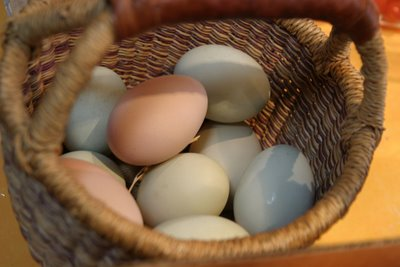

# Chapter 3: Things

A lot of the fun of interactive fiction comes from being able to pick up and use objects in the model world. At the beginning of this chapter, you’ll learn how to create things. Once you’ve started creating things, though, you’ll find that leaving them lying around where players can just pick them up won’t give players much of a challenge. We’ll also look at ways to hide things in the model world, so that finding a useful object becomes a puzzle.

Most of the things you’ll create in a game will have uses. Some kinds of things (such as keys) already have uses that Inform understands. But if you create a bicycle pump so that the player can blow up a flat tire, you’ll also need to create an _action_, as described in Chapter 4 of the _Handbook,_ so that the player can use the command INFLATE TIRE WITH PUMP. Creating actions so that things become useful is an important part of writing a good game.

Pretty much every object you create in your Inform game is a thing. Computer science majors would tell you that “thing” is a base class — a kind, in Inform’s terms — and that many other kinds, such as person and door, _inherit_ from the thing kind. But we don’t need to worry about that jargon. In this _Handbook_, we’ll usually call an object in your game a thing only when it isn’t any other kind of thing, such as a door or container.
