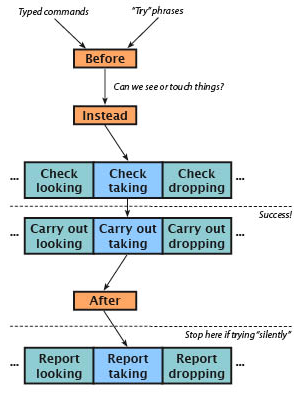

## Action Processing

Page 12.2 of _Writing with Inform_, “How actions are processed,” has a diagram (a flowchart) that shows — as you might expect — how actions are processed. The first time I looked at this diagram, it baffled me, but it really does make sense. (See [here](../chapter_4_actions/action_processing__summary.md#ction-processing-summary) for a detailed run-through of this diagram).



When the player types a command, the game goes through a number of steps. First it makes sure it knows what the input words are, and that the command makes grammatical sense. (This step isn’t in the diagram.) If there’s a typo in the input — or even if the parser knows all of the individual words but doesn’t understand how they’re strung together — the parser will reject the input before anything happens. Assuming the parser can figure out what the words are, and that they’re in a grammatical form that the parser knows, Inform starts processing the action.

The first step shown in the diagram is Inform looking to see if there is a Before rule that might affect the action. But in fact there’s a step before this, which is also not shown in the diagram. If the action includes a noun, as most actions do — PICK UP THE APPLE, for instance — the game first checks to make sure that there’s an object in the room that can be referred to as “apple.” If the apple is in a different room, it’s not in scope. Scope checking, which is explained briefly [here](../chapter_2_rooms_&_scenery/creating_your_first_room.md#creating-your-first-room) of this _Handbook,_ is one of the most important things the parser does, and it happens _before_ the Before rules are considered.

There’s an exception to this, as we’ll see in the section below on “[Any Thing]”. Inform also provides a way to add distant objects to scope. This can be useful, for example, when a large open area is defined in your code as several separate rooms. The player will expect to be able to see the beach ball after dropping it at the north end of the field, even when the player has moved off to the south end of the field. (“Indoors &amp; Outdoors” in Appendix C shows one way to do this.)

It’s easy to write your own Before rules for existing actions — but it’s also easy to create odd bugs with Before rules. While first learning to use Inform, you should probably stick with Instead rules when you need to alter the processing of a built-in action. As the diagram in 12.2 shows, _after_ the Before rules are considered, Inform pauses to figure out whether the objects being referred to are actually available for action processing — whether they can be touched. This is a narrower question than the question of whether an object is in scope. If an object is in a transparent container in the room, for instance, and if the container is closed and locked, the player can see what’s in the container, so objects in the container are in scope, and can be examined. (The action of examining is considered to be visually based, so you should avoid mentioning how objects feel or smell when writing their descriptions.) But the objects in the closed transparent container can’t actually be touched or taken.

Here’s the essential point: While the Before rules are being considered, Inform doesn’t yet know that the glass container is closed and locked! Here’s an example of a Before rule that may look sensible at first glance, but that will get you in trouble:

```inform7
The glass case is an openable lockable transparent container in the Lab. The glass case is closed and locked.

An apple is in the glass case. A wicker basket is an open container in the Lab.

Before taking the apple:
        if the player does not carry the apple:
                if the player carries the basket:
                        if the apple is not in the basket:
                                now the apple is in the basket;
                                say "You pick up the apple and put it in the basket.";
                                rule succeeds.
```

The author of this code might be trying to save the player a little work, by putting the apple into the basket automatically in response to the command TAKE APPLE. But can you see what’s going to happen? The Before rule tests several things, but it doesn’t test to make sure the apple is actually available for taking. And Inform doesn’t yet know that either, because the test for availability won’t be run until _after_ the Before rule is considered. The result is a bug — a player who is carrying the basket can get the apple out of the glass case without unlocking or opening the case!

```
>take apple
The glass case isn't open.

>take basket
Taken.

>take apple
You pick up the apple and put it in the basket.

>i
You are carrying:
    a wicker basket
      an apple
```

This illustrates why Before rules can be a little treacherous. Instead rules are safer. But sometimes a Before rule will give you better results. Consider this code:

```inform7
The jeweled crown is on the table. It is wearable.

Instead of wearing the jeweled crown:
        say "The king has warned you not to touch his crown."

```

If you use an Instead rule here, Inform will perform an implicit taking action, as shown earlier in this chapter. The implicit taking action will cause the player to pick up the crown before refusing to allow it to be worn. This happens because Inform assumes that things can only be donned while they’re being held. (In the original version of the _Handbook_, this example referred to the eating action, but I7 has been revised so that things can more easily be eaten without first being picked up. The details are a bit convoluted, but now the implicit taking of a portable edible thing happens in a Check rule, not in a Before rule.)

```
>wear crown
(first taking the jeweled crown)
The king has warned you not to touch his crown.

>i
You are carrying:
    a jeweled crown
```

A Before rule will run before the implicit take action happens, so the player won’t automatically pick up the cake before changing her mind about eating it:

```inform7
Before wearing the jeweled crown:
        say "The king has warned you not to touch his crown." instead.
```

Note the use of the word “instead” at the end of the Before rule above. This may look odd, since we’re writing a Before rule, not an Instead rule, but it’s a convenient syntax. In this case, what “instead” does is cause the Before rule to succeed (see “Rulebooks &amp; ‘Stop the Action’,” below), thus shutting off any further processing of the player’s command. If you forget to add “instead”, a Before rule _doesn’t_ shut off the action processing. The action will continue.

If that doesn’t make sense yet, keep reading. It will start to make sense — and it’s important.

For technical reasons, there’s only one Before rulebook and one Instead rulebook. As an action is being processed, Inform will run through these rulebooks looking for rules that might apply. Any rule that applies might end with a “rule succeeds” line, which will shut off any further processing. If none of the Before rules that Inform thinks might apply ends with a “rule succeeds” or “rule fails” (which in this case is pretty much the same thing) or an “instead” (which is equivalent to “rule succeeds”), Inform proceeds to the Instead rulebook, and then to the Check rulebook for the specific action. Each action has its own Check, Carry Out, and Report rules. Before the Report rules for the action are considered, though, Inform dips into the After rulebook (again, there’s only one, though it might contain dozens of rules applying to different actions). This is what the diagram on **p. 12.2** is illustrating. If no After rule shuts off the action processing, the Report rules for the current action will be considered.

>**Efficiency Tip**
>
>If you’re writing a game that may be played on an interpreter that runs in a Web browser or on a hand-held device (which pretty much means, if you’re writing an Inform game at all), you should avoid using Instead, Before, and After rules when possible. Use Check, Carry Out, and Report instead. As Inform guru Ron Newcomb has pointed out, an Inform game consults _all_ of the Before rules you’ve written as it processes _every_ command from the player. If a Before rule doesn’t stop the action processing, all of the Instead rules must then be considered. Depending on how many of these rules you’ve written, the game may become sluggish when played on a slow interpreter. For more on this topic, see “Code Optimization” in Chapter 10 of the _Handbook_, [here](../chapter_10_advanced_topics/advanced_topics.md#advanced-topics).

This cycle — Check, Carry Out, Report — is the nuts and bolts of how Inform processes actions. They’re what happens with built-in actions that are defined in the standard library. Before, Instead, and After are mostly for the author to use, though Inform has some built-in Before rules. You can also write your own Check, Carry Out, and Report rules, as we’ll see later in this chapter.

In a Check rule, Inform checks whether the action makes sense. The eating action (built-in) gives a good example of the use of a Check rule. If you haven’t told Inform that an object is edible, when the player tries to EAT it, the “can’t eat unless edible rule,” which is a Check rule for the eating action, will print out the message “That’s plainly inedible.” This rule will then fail (it ends with the line “rule fails”), which will stop Inform from going on to the Carry Out rulebook for the eating action.

If no Check rule gets in the way, the Carry Out rules will run next. The purpose of a Carry Out rule is to change the model world in whatever way is needed. In the case of the eating action, for instance, the Carry Out rule removes the edible object from play — because, obviously, it has just been eaten. Finally (unless an After rule has gotten in the way), the Report rule for the action will tell the player what has happened.

If we use the RULES debugging command to turn on reporting of rules, and then EAT something that we’ve declared as edible, we’ll see exactly which rules are running:

```
>eat apple
[Rule "declare everything initially unmentioned rule" applies.]
[Rule "announce items from multiple object lists rule" applies.]
[Rule "set pronouns from items from multiple object lists rule" applies.]
[Rule "before stage rule" applies.]
[Rule "instead stage rule" applies.]
[Rule "investigate player's awareness before action rule" applies.]
[Rule "player aware of his own actions rule" applies.]
[Rule "check stage rule" applies.]
[Rule "can't eat unless edible rule" applies.]
[Rule "can't eat clothing without removing it first rule" applies.]
[Rule "can't eat other people's food rule" applies.]
[Rule "can't eat portable food without carrying it rule" applies.]
[Rule "carry out stage rule" applies.]
[Rule "standard eating rule" applies.]
[Rule "after stage rule" applies.]
[Rule "investigate player's awareness after action rule" applies.]
[Rule "report stage rule" applies.]
[Rule "standard report eating rule" applies.]
You eat the apple. Not bad.
[Rule "last specific action-processing rule" applies.]

[Rule "A first turn sequence rule" applies.]
[Rule "every turn stage rule" applies.]
[Rule "A last turn sequence rule" applies.]
[Rule "notify score changes rule" applies.]
```

This rather intimidating list of rules is quite a bit longer than it was in earlier versions of Inform, because Inform is more careful than it used to be in its attempts to produce a realistic world model. On scanning the output above, you may think it’s odd at first that the “can’t eat clothing without removing it first rule” applies, since the apple is not clothing — but in this situation, “applies” doesn’t mean that the rule did anything. (The fact that Inform understands the concept of edible clothing is a little bizarre, but we won’t worry about that.) All that’s happening during the processing of this command is that Inform is _consulting_ those rules and then rejecting them. The result of the “standard eating rule” (a Carry Out rule) is that the apple is removed from the model world. It’s gone, because the player has eaten it. The “standard report eating rule,” a Report rule, then tells the player what has happened.

There are several ways for the author to get in and alter Inform’s action processing. You’ve already seen a couple of examples. For more, see the section on “Altered Actions,” below. Before we get to that, let’s take a closer look at how action processing rulebooks work.
