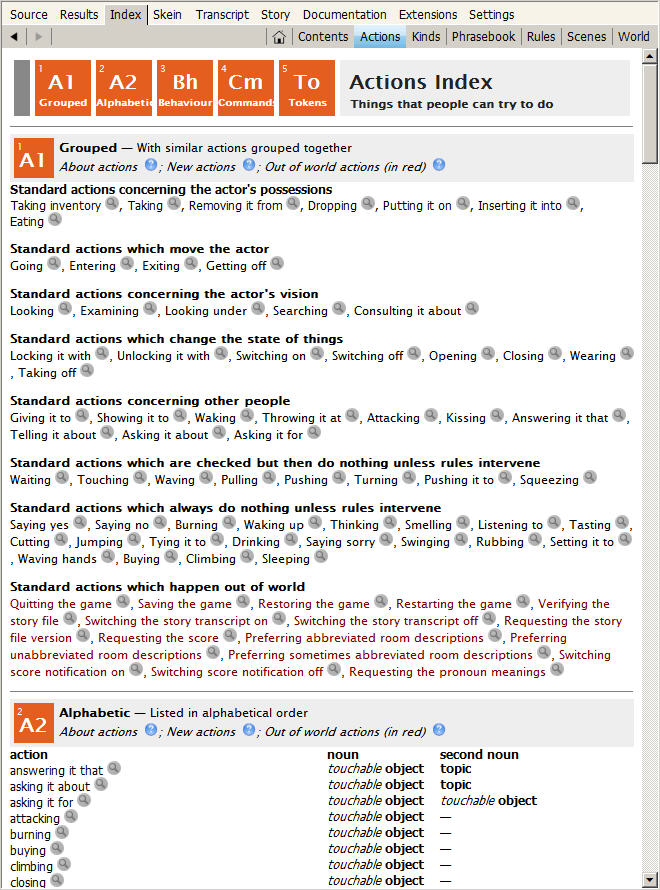

## Built-In Actions

From the moment you start writing your first interactive story, you’ll be able to use a handy set of actions that are built into Inform. To see the list of built-in actions, open up your game (or create a new game and add as little as a single room) and click the Go button. After the game compiles successfully, go to the Index tab and click on the Actions header. You’ll find a list of about 50 actions (see next page).

With no extra effort on your part, the player will be able to move from place to place, examine objects, pick them up, take inventory, drop objects that are being carried, put objects on top of supporters or in containers, open and close doors, wear and remove clothing, unlock or lock things that are locked, and so on.



If you click on the gray magnifying-glass button next to an action in the Actions Index, a page will open up in which you’ll learn more about that action. On the page describing an action, you’ll see a list of typed commands that can cause the action to happen and a list of rules that can affect the outcome after the action starts. This page may not list all of the exact synonyms. But there are several ways to figure out what actions are being generated by a given command word.

First, the SHOWVERB debugging command can be used in the game to display a list of the Inform 6 grammar lines that cause the action to happen. (For more on the relationship between Inform 6 and Inform 7, see [here](../chapter_10_advanced_topics/what_does_inform_6_have_to_do_with_inform_7.md#what-does-inform-6-have-to-do-with-inform-7)) Here, for instance, is the output for the drop action:

```
>showverb drop
Verb 'discard' 'drop' 'throw'
        * multiheld -> Drop
        * held 'at' / 'against' / 'on' / 'onto' noun -&gt; ThrowAt
        * multiexcept 'in' / 'into' / 'down' noun -&gt; Insert
        * multiexcept 'on' / 'onto' noun -&gt; PutOn
```

Don’t worry too much about the picky details of that output. (Inform 6 programmers will understand it at a glance.) The main point is that 'discard', 'drop', and 'throw' are all synonyms for an action — and all three words can lead to any of four different actions (Drop, ThrowAt, Insert, or PutOn). These action names are I6 code, not I7 — an important distinction. The I6 Insert action is invoked in I7 code using the phrase “inserting [it] into.”

Second, if you scroll down on the Actions page or click the red Cm button, you’ll find an alphabetical list of commands that are available to the player. If you’re trying to find out what action(s) can be generated by a command word, such as DISCARD, you can look it up in this list. You’ll find that it says, “same as drop.” And the four listings for DROP are exactly what’s shown above in the Inform 6 code: dropping, throwing it at, inserting it into, and putting it on.

Another useful feature of Inform is the ACTIONS debugging command. In debug mode only (that’s the mode you’re using as you work on your game), giving the ACTIONS command in the game turns on some special output that reveals more about what’s going on behind the scenes in the software. Here’s an example of how the ACTIONS debugging command works:

```
You can see an apple here.

>actions
Actions listing on.

>pick up apple
[taking the apple]
Taken.
[taking the apple - succeeded]
```

Here we find a listing for the action (the action of _taking_ with the apple as the noun), and also an indication that the action’s rules succeeded. Next, we’ll look at a slightly more interesting example. Here’s the action listing in the game for an absurd action, one that isn’t going to work:

```
>wear book
[wearing the book]
(first taking the book)
[(1) taking the book - silently]
[(1) taking the book - silently - succeeded]
You can't wear that!
[wearing the book - failed the can't wear what's not clothing rule]
```

The action listing reveals two things. First, the command WEAR triggers the _implicit_ action of taking. This is because Inform assumes that the player will need to be holding an object in order to put it on. Second, while the action of taking the book implicitly succeeded, the action of wearing the book failed. Inform tells us not only that it failed, but what specific rule caused it to fail. This information could be important if we want to replace that rule. Replacing the rules in the Standard Library is an advanced topic, however. It’s touched on only briefly in this _Handbook,_ in Chapter 10.

One of the common sources of frustration for newcomers to Inform is not knowing how to refer to the built-in actions in their code. One of the most frequent problems comes from the inserting it into action. Newcomers tend to try to refer to this action in what seems to be a natural way, like this:

```inform7
Instead of putting the apple in the basket: say "The basket scoots away from you!" [Error!]
```

But that doesn’t work, because there is no action called “putting it in.” Here’s the correct way to refer to this action:

```inform7
Instead of inserting the apple into the basket: say "The basket scoots away from you!"
```

By using the ACTIONS command and then using a command such as PUT APPLE IN BASKET in your game, you can see which action or actions are being triggered.
