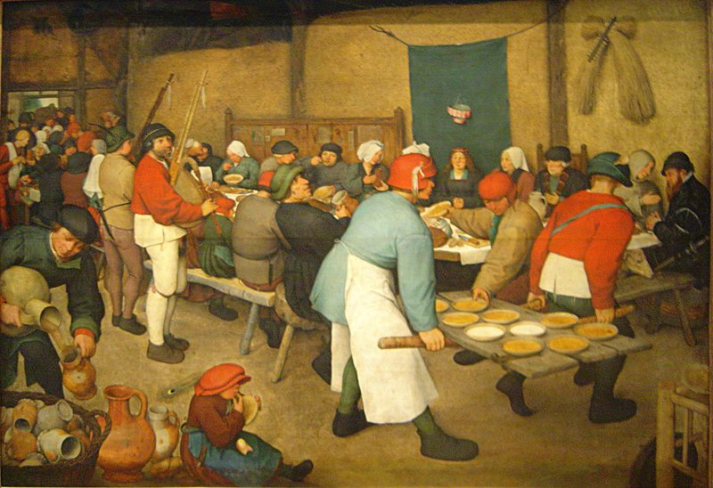

# Chapter 5: Creating Characters

Stories are about people. Because interactive fiction is a form of storytelling, it’s almost inevitable that you’ll want to include a few people in your game. A story with no people in it probably won’t be very interesting or fun — at least not for very long. If your players can’t do anything but wander around picking up treasures and fighting off monsters, before too long they’ll start to get bored. Besides, even a monster is a person, loosely speaking.

Using Inform, you can add people (or talking animals, or whatever sort of odd characters you’d like) to the games you write. Creating lifelike characters is an important skill to learn, and it may be the most complicated part of writing IF. In this chapter we’ll cover the basics of creating characters and also look at a few advanced techniques that you’ll probably want to use as your story develops.

Programming a non-player character (the abbreviation “NPC” is used throughout the interactive fiction community to refer to a non-player character) is complicated because people are complicated. Think about the differences between interacting with your Uncle Fred and interacting with a bowling ball. Uncle Fred does things on his own — that is, he initiates activities. A bowling ball doesn’t. Uncle Fred may observe you and comment on something you’re doing. A bowling ball won’t. Uncle Fred may respond to you differently depending on whether he’s happy or sad, or on whether he’s upset with you. A bowling ball will respond exactly the same whether it’s red or black or zebra-striped. (If it’s lopsided, all bets are off.)

The ways that people interact with one another are also complicated: Uncle Fred might respond differently if you shout or whisper, but a bowling ball won’t. To make matters worse, shouting and whispering are not modeled in most IF conversation systems.

Whoever plays your game will naturally hope (or worse, expect) that the player character will be able to interact with other characters the same way the player herself would interact with a real person. Sadly, that degree of realism is just about impossible to achieve using today’s interactive fiction programming tools. The parser is designed to accept in puts in the form ``<VERB> <NOUN> <PREPOSITION> <NOUN>``. Anything more complicated is not likely to work well. The only wrinkle that is usually added to this system is that the player may be able to give commands to an NPC. The syntax for this begins with the name (or other identifier, such as “dragon” or “frog”) of the NPC, then a comma, then the usual syntax. For instance, BOB, PUT THE BOMB ON THE TABLE.

Why not design a parser that will accept more complex interactions with NPCs? This turns out to be a difficult problem in computer science. Various people have tried it, but so far, the results have not been inspiring. Technically, it’s possible to write a game that will respond to whatever complicated player inputs you’d like. If you want your game to respond to ASK EMILY WHETHER EMILE’S DOG IS STILL TOO SICK TO HUNT FOR THE SQUIRREL, you can do it using the “after reading a command” activity, as explained on **p. 18.33** of _Writing with Inform_, “Reading a command.” But there are several problems with this type of trick, including the problem of letting the player know that such a complex input is possible. I don’t recommend that authors go down that road in their first or second game.

>**Believable Characters**
>
>Characters will seem more believable if the player’s interaction with them is limited. This could be because the NPC plays a limited role in the story, or does not know the PC (player character): It’s a lot easier to make a guard believable than a girlfriend! You can also limit the interaction with a character by moving the character onstage and offstage again quickly. Characters who have a single-minded obsession with one thing (for instance, a king who only cares about whether you’re a spy) are easier to create than characters who are just hanging out. But the latter sort (Emily Short’s Galatea, from the game of the same name) can be vivid and memorable.

Even while sticking within the limitations of “normal” IF programming, we can employ various tricks to make our characters seem more real. The characters may be just the software equivalent of cardboard, but players will enjoy meeting and talking with them.

Before we start talking about specific programming techniques, we need to talk about how you might want to use characters in your interactive story. What roles or functions might they take on?
