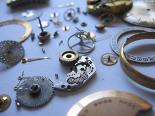

## Assembly Required {#assembly-required}

Sometimes objects have been taken apart, and the player has to put them back together in order to use them. In Chapter 3 of this _Handbook_ we looked at a postcard and a stamp. The stamp could be attached to the postcard. If this is a puzzle, maybe the player would then have to put the postcard into a slot in the Post Office. If the stamp hasn’t been attached, the message will never be delivered.

Another simple example would be a length of metal pipe that can be inserted into an appropriately positioned hole in a machine. When the player does this, the piece of metal becomes a crank that can be turned.

The relationships among the parts may be obvious — a lightbulb that needs to be put in a lamp, for instance. Or the player may be called on to improvise by assembling objects that have no obvious relationship to one another.

“The King of Shreds & Patches” has a very nice assembly puzzle in the form of a flintlock pistol that has to be loaded before it can be fired. The materials (powder, lead balls, and so on) are all readily at hand, but the player has to figure out how to manipulate them. What’s especially nice about this puzzle is that once the player has done it the first time the hard way, the command LOAD PISTOL can be used as a shortcut to do it again.
