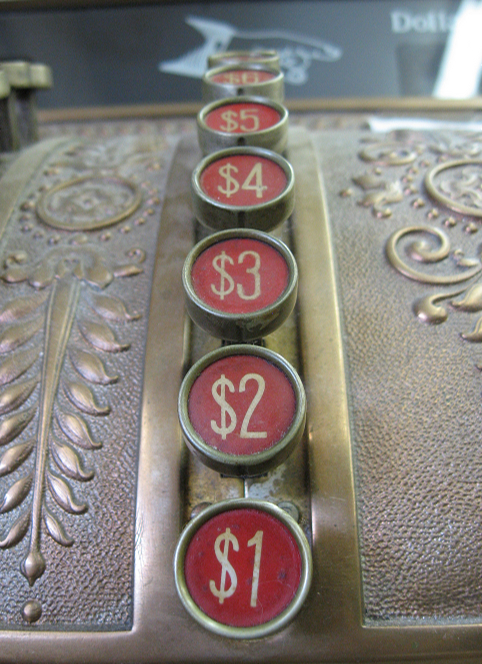

## Manipulation Difficulties

Many games include objects that are too heavy to lift, too hot, too slippery, or difficult to handle for some other reason. This type of puzzle offers many opportunities for the author. Providing a handy oven mitt for picking up the hot object might be too obvious: you might want to give the player a baseball glove instead.



Figuring out how to operate machinery can be easy, or almost endlessly complicated. In “The Craft of Adventure,” Graham Nelson comments, “In some ways the easiest puzzles to write sensibly are machines, which need to be manipulated: levers to pull, switches to press, cogs to turn, ropes to pull.... They often require tools, which brings in objects. They can transform things in a semi-magical way (coal to diamonds being the cliché) and can plausibly do almost anything if sufficiently mysterious and strange: time travel, for instance.”

Among the things one may find in a game that pose manipulation difficulties — and also implementation difficulties for the author — are fire, water, rope, and chemicals of all kinds. Chapter 10 of the _Inform Recipe Book_ has some good examples of how to create puzzles of this type. You might want the player to mix three chemicals to create a new substance, for instance. Mixing would naturally require a container that the ingredients can be put into. (The cocoa mug puzzle in “Lydia’s Heart” was easily the most complex and difficult puzzle to write in the game, and I’m still not sure it’s free of bugs. The puzzle had three ingredients — a paper envelope full of powdered cocoa, a sleeping pill, and some water. The water could be either hot or cold, and once the pill or powder was combined with the water, it couldn’t be extracted again. This kind of thing can be fun if it’s well done, but it’s treacherously easy to do it badly.)

Here’s a simpler example of a manipulation difficulty puzzle, which was suggested by a post from Susie on the newsgroup. The player can only see things while wearing glasses. To implement this, we need to intercept both the LOOK and EXAMINE actions. It also seems advisable to stop the player from picking things up while not wearing the glasses. But if we do that, we also have to be careful to allow her to pick up the glasses while not wearing them — otherwise, dropping the glasses will make the game unwinnable.

```inform7
The player is wearing some glasses. The description is "They're as thick as bottle-bottoms." Understand "bifocals" and "spectacles" as the glasses.

Instead of looking when the player is not wearing the glasses:
        say "Unfortunately, you're as blind as a bat without your glasses."
Instead of examining something when the player is not wearing the glasses:
        try looking instead.

Instead of taking something when the player is not wearing the glasses:
        say "You grope around, but you can't find a darn thing."

Instead of taking the glasses when the player is not wearing the glasses:
        if the player does not enclose the glasses:
                say "You grope around blindly and somehow find your glasses.";
                now the player carries the glasses;
        otherwise:
                say "You've already got them."
```

Because the instead rule about taking the glasses is more specific than the instead rule about taking something, it will be listed earlier in the instead rulebook. This is what we want: The player will be able to pick up the glasses.

A subtype of manipulation difficulties is what we might call the strapped-to-a-table puzzle. I’ve seen this puzzle presented at the beginning of a game, but it might happen at any point, especially after the player character has been knocked unconscious. The puzzle is, you don’t seem to be able to do _anything._ The repertoire of actions normally allowed in IF is all (or seemingly all) disabled. In Emily Short’s one-room game “Glass,” for instance, you’re a bird on a perch. Your wings have been clipped, so you can’t even fly. Eventually the player discovers that there’s one thing that the bird _can_ do. But I’ll let you discover for yourself what it is.
