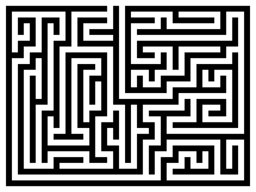

## Mapping

Creating and maintaining a map that shows the layout of the game isn’t much of a puzzle, but it definitely qualifies. The player who neglects to create a pencilled map on which she notes that there’s a south exit from the Library is quite likely to miss something important in the game.

Many games today include a full list of available exits (or at least, of the obvious exits ― see below) as part of the room description. In some older games, this convention wasn’t adhered to: exits might not be mentioned at all. Trying all of the available compass directions, only to be told over and over, “You can’t go that way,” is not much fun, which is why this type of puzzle isn’t much used anymore.

The classic example of a mapping puzzle is a maze. A maze is a set of rooms (usually between ten and fifty of them) in which the player can move freely, but in which navigation is difficult for some reason. Most players don’t like mazes, because mazes can be mind-numbingly repetitive to solve.

The original game of Adventure had two mazes. The room descriptions within each maze were all identical (and no exits were listed), so just LOOKing wouldn’t tell you where you were. The connections between rooms in a maze is likely to be “twisty,” which means that if you go north from room A and arrive in room B, going south from room B quite likely won’t take you back to room A. Some room connections may even fold back on themselves: When you go east from room A, you may end up back in room A! This type of navigation system is easy to set up in Inform (see “Twisty Connections” in Chapter 2 of the _Handbook_).

The time-honored way to map this type of maze is to drop an object in each room as you go along. The pattern of dropped objects then allows the player to differentiate the rooms from one another and work out the navigational routes. If you put this type of maze in a modern game, it’s safe to say you’ll amuse nobody. But there are many ways to make mazes interesting (at least, they’ll be interesting to people who don’t mind mazes). In “A Flustered Duck,” I included a maze that could only be mapped while the player character is wearing a blindfold. When the blindfold is not worn, the connections between rooms are entirely random and the room descriptions are all identical — but when the PC is wearing a blindfold, he can find distinct room connections using his sense of touch.
