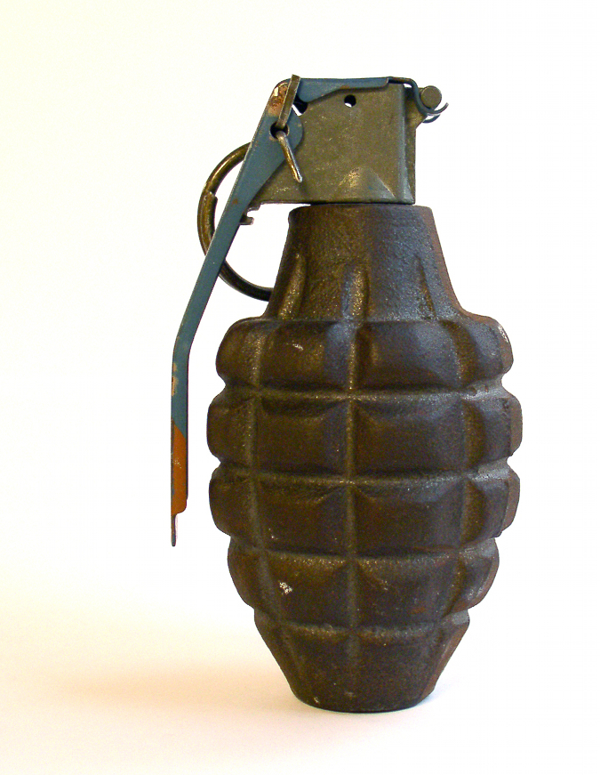

## Timed Puzzles {#timed-puzzles}

Generally speaking, time passes in IF only when you issue a command. (A few games include real-time events, but this is not common.) In a timed puzzle, something is happening, and you need to interact with it within a specified number of turns. You may need to figure out the proper command, or even issue a whole sequence of commands, within a fixed time-frame.

The simplest type of timed puzzle is, of course, a lighted fuse attached to a bomb. Also simple (and dating back to the very first IF) is the light source that will expire after a fixed number of turns, perhaps because it’s a battery-powered flashlight. The player who is left in a dark room when the battery dies is likely to be in serious trouble. In the early days of IF, games sometimes required that the PC eat and/or sleep on a regular schedule; failure to do so would have bad consequences. Eating and sleeping are no longer common in modern games, because they’re not very interesting.

The rowboat puzzle in “King of Shreds &amp; Patches” is a complex timed puzzle. You’re in a boat on a river, and the boat is being carried downstream by the current. Unless you visualize clearly how the boat is moving and issue the correct navigation commands, you’ll be unable to reach the dock before the small hole in the bottom of the boat causes the boat to sink.

If you fail to take the proper action in a timed puzzle, the game will almost certainly become unwinnable, and quite likely will end in a sudden and spectacular way. Timed puzzles are, by their nature, somewhat more cruel than other types of puzzles, because the possibility of losing the game is more immediate.

A relative of the timed puzzle is what might be called a course-of-events game. In a game of this sort, you may be able to get from the start of the story to the end by typing ‘z’ over and over — no action is required, as the course of events will unfold without your taking any action at all. However, if you do that, you may well miss the point of the story entirely, or fail to reach the most desirable ending. Your opportunity to influence the course of events (and thereby steer the course of the story) will have passed unnoticed. The puzzle lies in figuring out exactly how your actions may influence the course of events. Asking certain questions of a character at certain times, for instance, may have a large effect — but it may not be obvious what to ask, or when. Emily Short’s short game “Glass” provides an excellent example of this type of puzzle.
