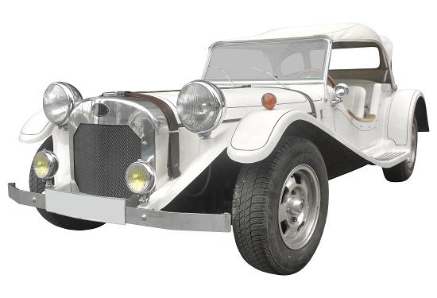

## Vehicles

A vehicle in which the player can travel around will seldom be a puzzle in its own right. More often, it’s an example of one or two other types of puzzles ― mapping and manipulation difficulties. That is, you’ll need to figure out how to use the vehicle, which may involve finding the lost steering wheel or just understanding what the red and green buttons do; and then learn, probably by pressing the red button, where it can take you. On occasion you may have to fuel the vehicle, which would come under the heading “Assembly Required.” You may find that some objects can’t be carried in the vehicle, which would be an inventory-blocked passageway, or that the vehicle is required in order to carry certain objects from place to place — again, an inventory-blocked passageway. You may need to get out of the moving vehicle at a specific moment, which would be a timed puzzle.

Conveyances such as wheelbarrows, that have to be pushed from place to place, are used, again, mainly as a way of handling inventory objects.
