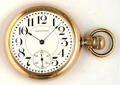

## Passing Time

Inform doesn’t do anything to mark the passage of time in a game unless you tell it to. All the same, it’s quietly keeping track of the number of turns that have passed since the beginning of the game. Unless you write some code that changes the default, Inform starts the game at 9:00 A.M. Each time the player enters a sensible command, one minute passes. But if the player types something that the parser doesn’t understand, no time passes.

A simple way to see this mechanism in action is to add this code to your game:

```inform7
When play begins:
        now the right hand status line is "[time of day]".
```

The status line is the bar across the top of the game window. Normally (unless you do something to change it), the right side of the status line is empty, but this code can be used to show the number of points the player has earned (“[score]”), for example. The code above changes the status line to show the time of day. For more, see **p. 8.3** of _Writing with Inform_, “Changing the status line.”

As a courtesy to the player, you might want to have no time pass when the player is simply using the LOOK command to refresh her memory about the room, or the INV (or I) command to remind herself what she’s carrying. To do that, use this code:

```inform7
Every turn:
        if the current action is taking inventory or the current action is looking:
                now the time of day is 1 minute before the time of day.
```

We’ll have more to say about Every Turn rules later in this chapter. Another way to do the same thing is to use a Before rule rather than an Every Turn rule:

```inform7
Before looking or taking inventory:
        now the time of day is 1 minute before the time of day.
```



The downside of using a Before rule in this case is that the first action when a game starts is a look action. That’s what causes the initial room description to print. So if you use a Before rule in this case, the game will be starting one minute before you think it does, which could be a problem in a game that opens with a tight timing puzzle.

Example 407, “Timeless,” shows a different way to accomplish the same thing.

The game doesn’t have to start at 9:00 A.M. If you want it to start at 3:00 in the afternoon, do this:

```inform7
When play begins:
        now the time of day is 3:00 pm.
```

If you want time to jump ahead for some reason (such as when the player character has been hit on the head and is unconscious for a while), include a line like this in your code as part of what happens when the player is hit:

```inform7
now the time of day is 7:00 pm.
```

If you want something to happen at a specific time, one way to do it — the primitive, clumsy way, as I’ll explain in a moment — is with an Every Turn rule:

```inform7
Every turn:
        if the time of day is 11:59 pm or the time of day is 12:59 am or the time of day is 1:59 am:
                say "In the distance you hear the chimes in the tower strike the hour."
```

As you can see, I’ve set the chimes to ring one minute _before_ the hour. This is because of the way Inform runs your Every Turn rules. Every Turn rules run before the Advance Time rule. If you do it as shown above, the message about the chimes in the tower will be printed out on the hour.

In this case, Inform has a simpler way to get the same effect. You can write a rule that tells the game what to do at specific times:

```inform7
At 11:59 pm: say chimes.
At 12:59 am: say chimes.
At 1:59 am: say chimes.

To say chimes: say "In the distance you hear the chimes in the tower strike the hour."
```

This way of doing it is easier to write and debug, especially when you want the chimes to ring every hour for 24 hours, rather than only at three times, as shown.

The main reason to want to keep track of the current time (and let the player know what time it is) is because time is passing in the model world. In some games, the player character will get hungry and/or thirsty on a regular schedule, so finding food and water will be one of the puzzles. If the game includes a realistic alternation of day and night, at a certain time in the evening the player might need to find a place to sleep. Some people consider eating and sleeping puzzles old-fashioned, but timed puzzles can be interesting if handled in a creative way.
