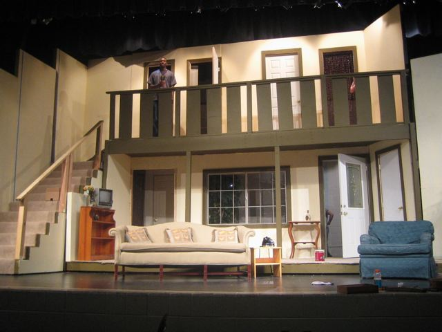

# Chapter 8: Time &amp; Scenes {#chapter-8-time-scenes}

Lots of interactive fiction games take place in a sort of “eternal now.” The player is free to wander around, trying whatever commands she thinks of. No matter how many turns she takes, nothing changes in the model world except when she takes an action that changes it.

In other games, though, the passage of time has some effect on the game-play. That is, the game counts the number of turns the player spends doing things, and makes some change after a set number of turns. For instance, the sun might set, in which case outdoor rooms would become dark. In almost all games, nothing whatever happens between the player’s commands: time passes only when the player does something. A very few games include some sort of “real time” routine to force the player to type the correct command within a few seconds, but these games are quite rare, and we’re not going to worry about them in this book.

Inform has three systems with which you can organize the passage of time of your game. In this chapter we’ll look at all of them.
